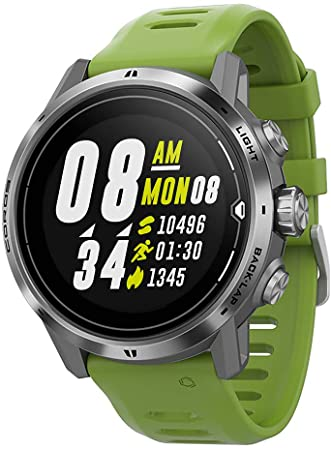

## COROS APEX Pro

Details about the [APEX Pro](https://coros.com/apex-pro) can be found on the COROS website.

GPS-Speedsurfing.com (GP3S) and COROS worked together to develop a tailor made workout mode. This includes additional data for run verification and automatic uploading to GP3S. Further details can be found on the GP3S [website](https://www.gps-speedsurfing.com/default.aspx?mnu=item&item=coros).

I made notes about my [first impressions](first-impressions.md) of the APEX Pro when I first received the watch in June 2021. I have subsequently written these up in a short article.

### Specifications

| Item          | Details                                                      |
| ------------- | ------------------------------------------------------------ |
| Logging       | 1Hz                                                          |
| Memory        | [200 hours](https://support.coros.com/hc/en-us/articles/360044993811-How-much-memory-do-COROS-watches-have) |
| Battery       | 30 days (non-GPS) / 40 hours (GPS)                           |
| Charging      | Custom USB cable                                             |
| Download      | Export from the COROS app - e.g. Dropbox                     |
| Auto Upload   | [Yes](https://www.gps-speedsurfing.com/default.aspx?mnu=item&item=HowAddSession) |
| Best Format   | [FIT](https://developer.garmin.com/fit/protocol/)            |
| Other Formats | [GPX](https://en.wikipedia.org/wiki/GPS_Exchange_Format)     |
| GPS chipset   | [Sony](https://www.sony-semicon.co.jp/e/products/lsi/gps/product.html) - probably the CXD5603GF |

### Data Issues

I have written a separate article, summarising the observable [data issues](../data-issues.md) on the APEX Pro and VERTIX with links to further details and analysis. The data issues can be summarised as follows:

- Repeated speeds are not uncommon in the data (e.g. exactly the same speed for 5 or 6 seconds) and I've even seen speeds repeated for as long as 12 or 13 seconds.
- The resolution of Doppler speed data is only to within 5cm/s. This is 5 times lower than devices from Locosys and 50 times lower than devices such as the Motion.

### Tips

Since the APEX Pro, VERTIX and VERTIX 2 are so similar in features. all of the [tips](../tips.md) are identical.
