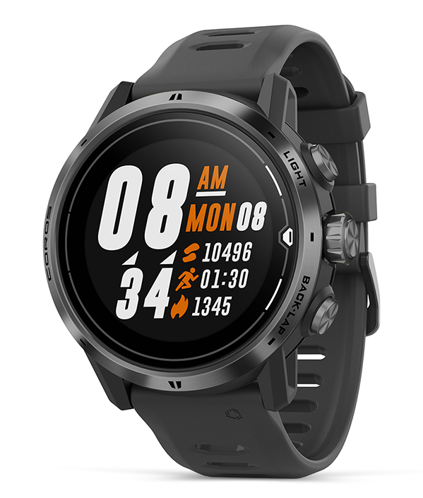

## COROS APEX Pro

### First Impressions

This isn't a full review (or even a mini-review) and is simply a list of bullet points that I noted down after my first few sessions using the APEX Pro.

#### Pros

- Well made product with a comfortable wrist strap.
  - Probably waterproof but this will only be proven in time.
- Battery life is very impressive - 30 days (non-GPS) or 40 hours (GPS).
- Easy of use - nice interface on the watch and in the COROS app. The dial is intuitive.
- On the water display - shows most GP3S speed categories, including nautical mile.
  - Customisable screens in the speed sailing mode are also very useful.
- End of session - auto-syncs with the COROS app, enabling easy review on mobile devices.
- Automatic upload to GP3S - available for posting via a web browser, even on a phone.
- Can export sessions as [FIT](https://developer.garmin.com/fit/protocol/) data from the COROS app to Dropbox, etc.
- Other features - GoPro control, saving current position, heart rate, etc.

#### Cons

- Wheel control is sometimes unresponsive when trying to unlock / control the watch.
  - Scrolling in the opposite problem will usually resolve the issue.
- There is no "peak" speed reading as such, only the best 2s average.
  - However, instantaneous speeds can be misleading due to "noise", etc.
- Data quality is ok but certainly nothing special.
  - Not as good as the traditional [Locosysy](../../locosys/README.md) devices; GT-31, GW-52, GW-60.
- Results in the COROS app can differ from GP3S upload and FIT export.
  - Alpha 500 results on the watch and COROS app are often very wrong.
- Pretty expensive at slightly over £400 but the cost is evident in the build quality.
  - Need to consider the risk of losing it on the water... one friend lost his APEX Pro!

#### Setup

- Linking COROS and GP3S accounts was straightforward for automatic uploads.
- I originally decided to set the GPS mode to [GPS/GZSS](https://support.coros.com/hc/en-us/articles/360039840372-More-Settings-Menu).
  - After upgrading the [firmware](https://mobile.coros.com/release) in March 2022, I chose "GPS, Beidou, Galileo, QZSS".

#### Issues

- Session summary was not correctly counting or reporting all of the runs.
  - This improved after increasing the "run entry speed" to the max of 12 knots.
  - Speeds reported on the app sometimes changed when posting to GP3S.
  - Alpha results on the watch and COROS app were observed to be very unreliable.
- Auto-Sync to GP3S often resulted in duplicate sessions available for posting.
  - Update: This issue does not seem to happen nowadays; March 2022.
- Early analysis in GPSResults lacked some data; Satellites, COG, HDOP, SDOP, +/-.
  - This has been confirmed as being due to the content of the earlier FIT files.
  - All of my FIT exports since early Oct 2021 have contained Satellites, COG, HDOP.
  - Sessions from [Mark](../../../sessions/contacts/mark/README.md) include additional data as of late July 2021. Possibly due to changes in [2.54](https://support.coros.com/hc/en-us/articles/360039842992-Released-updates-for-COROS-APEX-Pro)?
- I could not see any of the water sports sessions on the COROS website.
  - Most other activities were visible on [workout history](https://en.coros.com/web/webdata/datalist.html); run, bike, swim, triathlon, etc.
  - Subsequently discovered all of the water sports sessions in the personal [workout list](https://t.coros.com/admin/views/activities).
- GPX tracks cannot be trusted for speeds.
  - This is fine and is to be expected to some extent. Export FIT data for the best data.
- FIT data suggests that speeds are being smoothed and somewhat unrealistic.
  - See my article describing the [data issues](../data-issues.md) on the APEX Pro and VERTIX.
