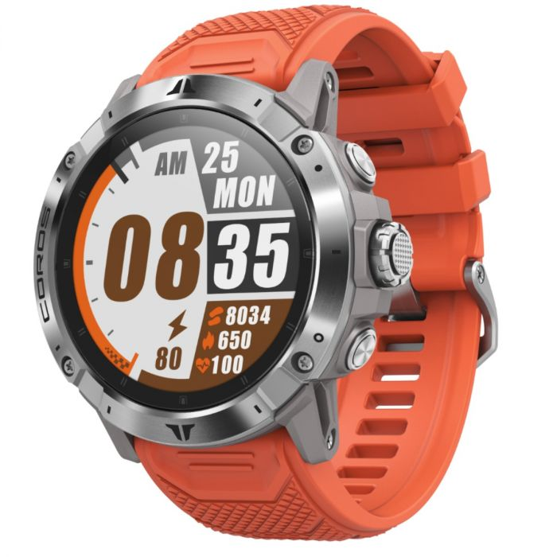

## COROS VERTIX 2

Details about the [VERTIX 2](https://coros.com/vertix2) can be found on the COROS website.

GPS-Speedsurfing.com (GP3S) and COROS worked together to develop a tailor made workout mode. This includes additional data for session verification and automatic uploading to GP3S. Further details can be found on the GP3S [website](https://www.gps-speedsurfing.com/default.aspx?mnu=item&item=coros).

The VERTIX 2 is basically an upgraded [VERTIX](../vertix/README.md) with improved battery life and a different GPS chip; replacing the Sony with one from Airoha.

### Specifications

| Item          | Details                                                      |
| ------------- | ------------------------------------------------------------ |
| Logging       | 1Hz                                                          |
| Memory        | [200 hours](https://support.coros.com/hc/en-us/articles/360044993811-How-much-memory-do-COROS-watches-have) |
| Battery       | 60 days (non-GPS) / 140 hours (GPS)                          |
| Charging      | Custom USB cable                                             |
| Download      | Export from the COROS app - e.g. Dropbox                     |
| Auto Upload   | [Yes](https://www.gps-speedsurfing.com/default.aspx?mnu=item&item=HowAddSession) |
| Best Format   | [FIT](https://developer.garmin.com/fit/protocol/)            |
| Other Formats | [GPX](https://en.wikipedia.org/wiki/GPS_Exchange_Format)     |
| GPS chipset   | [Airoha AG3335M](http://www.airoha.com.tw/webe/html/pro/index.aspx?kind=80&num=182&lv=2) |

### Data Quality

The VERTIX 2 has a different GPS chipset to the VERTIX and APEX Pro, so I cannot comment on the likely data quality at this time.

### Tips

Since the APEX Pro, VERTIX and VERTIX 2 are so similar in features. all of the [tips](../tips.md) are identical.
