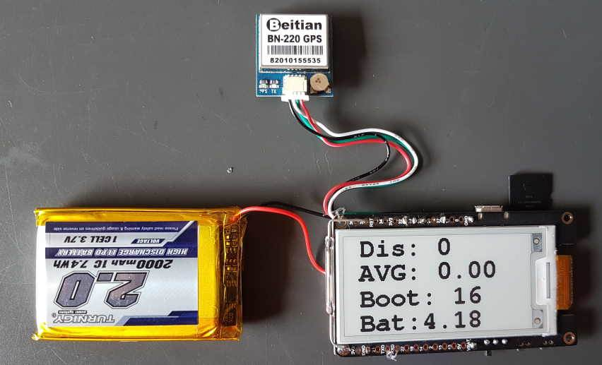

## ESP-GPS

The ESP-GPS is an inexpensive GPS logger with display, specifically designed for speedsurfing.

It is designed to be easy to build yourself with readily available components. It uses the Beitian BN220 / BN280 GPS chips which are based on the u-blox [NEO-M8N](https://www.u-blox.com/en/product/neo-m8-series) GNSS module.

The device provides superior data quality compared to the popular [Locosys](../locosys/README.md) devices and modern smart / sports watches from the likes of COROS, Garmin, Suunto and Polar.

The code is now open source and can be found on [GitHub](https://github.com/RP6conrad/ESP-GPS-Logger). Recent news and community participation can be found on [Seabreeze.com](https://www.seabreeze.com.au/forums/Windsurfing/Gps/Another-DIY-GPS-logger-approach).

Full details of the [ESP-GPS](https://tinyurl.com/yc87n4p5), including the [DIY](https://en.wikipedia.org/wiki/Do_it_yourself) instructions are available in a Google document.

### Specifications

| Item                                                       | Details                                                      |
| ---------------------------------------------------------- | ------------------------------------------------------------ |
| Logging                                                    | 1 Hz, 2 Hz,  5 Hz or 10 Hz                                   |
| Memory                                                     | Micro SD card                                                |
| Battery                                                    | ~15 hours                                                    |
| Charging                                                   | Micro USB cable or Wireless                                  |
| Download                                                   | [FTP](https://en.wikipedia.org/wiki/File_Transfer_Protocol) - connect to built-in FTP server |
| Best Format                                                | [OAO](https://www.motion-gps.com/motion/documentation/oao-file-format.html) |
| Other Formats                                              | UBX                                                          |
| GPS chipset                                                | Beitian BN180 / BN220 / BN280 - based on u-blox [UBX-M8030](https://www.u-blox.com/en/product/ubx-m8030-series) |
| Additional Logging                                         | Sats, HDOP, sAcc                                             |
| Approved for [GP3S](https://www.gps-speedsurfing.com/)     | [Yes](https://www.gps-speedsurfing.com/default.aspx?mnu=item&item=gpsother) |
| Approved for [GPSTC](https://www.gpsteamchallenge.com.au/) | No                                                           |
