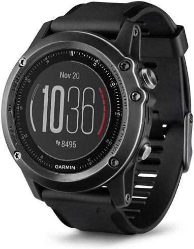

## Garmin Fenix 3 / HR

The Fenix 3 and Fenix 3 HR were released in 2015 / 2016 respectively.

Details about the [Fenix 3 / HR](https://www.garmin.com/en-GB/p/160512) can still be found on the Garmin website, plus the [manual](https://www8.garmin.com/manuals/webhelp/fenix3/EN-US/GUID-62011D9B-67F0-48B6-8A06-B0C0E6276F7E-homepage.html).

### Tips

- Please read the general [guidance](../../../guidance.md) for all users of smart / sports watches.
- Change the data recording interval to "every second". The default is "smart" and is unsuitable for speed sailing.
- Export the session in the .FIT format in the Garmin Connect app. Do this using the "[original](https://support.garmin.com/en-GB/?faq=W1TvTPW8JZ6LfJSfK512Q8)" format.
- Try installing the [GPSTC data fields](https://www.haigh.id.au/GPSTC.htm) by TBWonder to monitor your best 2s, 10s, 5 x 10s, 1852m, alpha 500m and hour.

### Specifications

| Item                                                       | Details                                                      |
| ---------------------------------------------------------- | ------------------------------------------------------------ |
| Logging                                                    | 1 Hz when recording interval is set to "every second"        |
| Memory                                                     | TBC                                                          |
| Battery                                                    | up to 20 h                                                   |
| Charging                                                   | Custom USB cable                                             |
| Download                                                   | Export from Garmin Connect |
| Best Format                                                | [FIT](https://developer.garmin.com/fit/protocol/)            |
| Other Formats                                              | [GPX](https://en.wikipedia.org/wiki/GPS_Exchange_Format) + [TCX](https://en.wikipedia.org/wiki/Training_Center_XML)     |
| GPS chipset                                                | MediaTek [MT3333](https://www.mediatek.com/products/location-intelligence/mt3333) |
| Additional Logging                                         | No                                                           |
| Approved for [GP3S](https://www.gps-speedsurfing.com/)     | No                                                           |
| Approved for [GPSTC](https://www.gpsteamchallenge.com.au/) | No                                                           |
