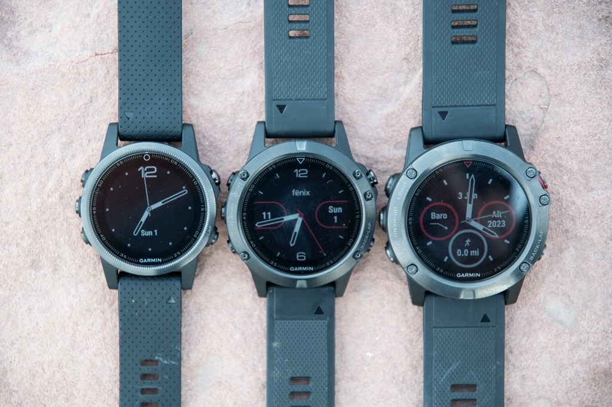

## Garmin Fenix 5S / 5 / 5X

Details about the [Fenix 5S](https://www.garmin.com/en-GB/p/552237) + [Fenix 5](https://www.garmin.com/en-GB/p/552982) + [Fenix 5X](https://www.garmin.com/en-GB/p/560327) can still be found on the Garmin website, plus the [manual](https://www8.garmin.com/manuals/webhelp/fenix5/EN-US/GUID-C8E25FD1-3499-4B5C-B45F-C4BF88283284-homepage.html).

The Fenix 5 range was first released in 2017. The 5S (left) is the smaller model and 5X (right) is the larger model.

### Tips

- Please read the general [guidance](../../../guidance.md) for all users of smart / sports watches.
- Change the data recording interval to "every second". The default is "smart" and is unsuitable for speed sailing.
- Export the session in the .FIT format in the Garmin Connect app. Do this using the "[original](https://support.garmin.com/en-GB/?faq=W1TvTPW8JZ6LfJSfK512Q8)" format.
- Try installing the [GPSTC data fields](https://www.haigh.id.au/GPSTC.htm) by TBWonder to monitor your best 2s, 10s, 5 x 10s, 1852m, alpha 500m and hour.

### Specifications

| Item                                                       | Details                                                      |
| ---------------------------------------------------------- | ------------------------------------------------------------ |
| Logging                                                    | 1 Hz when recording interval is set to "every second"        |
| Memory                                                     | TBC                                                          |
| Battery                                                    | 14 h (Fenix 5S) / 24 h (Fenix 5) / 40 h (Fenix 5X)           |
| Charging                                                   | Custom USB cable                                             |
| Download                                                   | Export from Garmin Connect as "[original](https://support.garmin.com/en-GB/?faq=W1TvTPW8JZ6LfJSfK512Q8)" format |
| Best Format                                                | [FIT](https://developer.garmin.com/fit/protocol/)            |
| Other Formats                                              | [GPX](https://en.wikipedia.org/wiki/GPS_Exchange_Format)     |
| GPS chipset                                                | MediaTek [MT3333](https://labs.mediatek.com/en/chipset/MT3333) |
| Approved for [GP3S](https://www.gps-speedsurfing.com/)     | No                                                           |
| Approved for [GPSTC](https://www.gpsteamchallenge.com.au/) | No                                                           |
