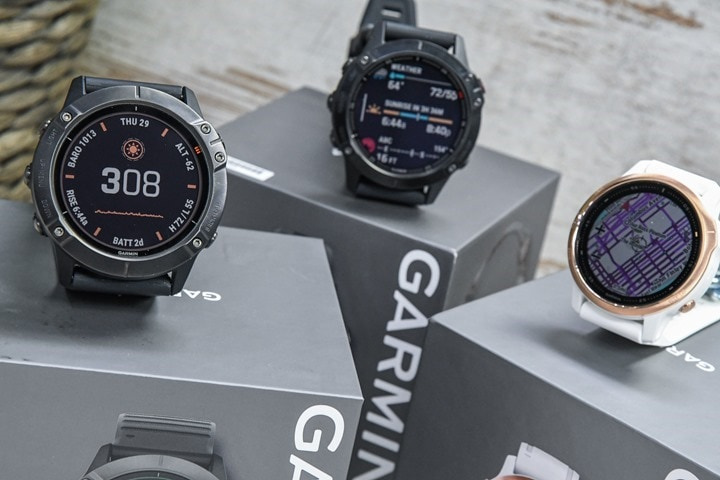

## Garmin Fenix 6S / 6 / 6X

The Fenix 6 range was released in 2019. The 6X (left) is the larger model and 6S (right) is the smaller model.

There is a Sapphire, Pro and Solar edition for each of the 3 sizes, making 9 watches in total. The only differences are the Sapphire glass vs Gorilla glass (Pro) vs Power glass (Solar) and protective coatings on the metal parts.

Details about the [Fenix 6S](https://www.garmin.com/en-GB/p/641501) + [Fenix 6](https://www.garmin.com/en-GB/p/641449) + [Fenix 6X](https://www.garmin.com/en-GB/p/641435) can be found on the Garmin website, plus the [manual](https://www8.garmin.com/manuals/webhelp/fenix66s6xpro/EN-US/GUID-9C813064-813F-45E8-9F8E-98A2485B1BB1-homepage.html).

### Tips

- Please read the general [guidance](../../../guidance.md) for all users of smart / sports watches.
- Change the data recording interval to "every second". The default is "smart" and is unsuitable for speed sailing.
- Export the session in the .FIT format in the Garmin Connect app. Do this using the "[original](https://support.garmin.com/en-GB/?faq=W1TvTPW8JZ6LfJSfK512Q8)" format.
- Try installing the [GPSTC data fields](https://www.haigh.id.au/GPSTC.htm) by TBWonder to monitor your best 2s, 10s, 5 x 10s, 1852m, alpha 500m and hour.

### Specifications

| Item                                                       | Details                                                      |
| ---------------------------------------------------------- | ------------------------------------------------------------ |
| Logging                                                    | 1 Hz when recording interval is set to "every second"        |
| Memory                                                     | TBC                                                          |
| Battery                                                    | 25 h (Fenix 6S) / 36 h (Fenix 6) / 60 h (Fenix 6X)           |
| Charging                                                   | Custom USB cable                                             |
| Download                                                   | Export from Garmin Connect                                   |
| Best Format                                                | [FIT](https://developer.garmin.com/fit/protocol/)            |
| Other Formats                                              | [GPX](https://en.wikipedia.org/wiki/GPS_Exchange_Format) + [TCX](https://en.wikipedia.org/wiki/Training_Center_XML) |
| GPS chipset                                                | [Sony](https://www.sony-semicon.co.jp/e/products/lsi/gps/product.html) CXD5603GF |
| Additional Logging                                         | No                                                           |
| Approved for [GP3S](https://www.gps-speedsurfing.com/)     | No                                                           |
| Approved for [GPSTC](https://www.gpsteamchallenge.com.au/) | No                                                           |

