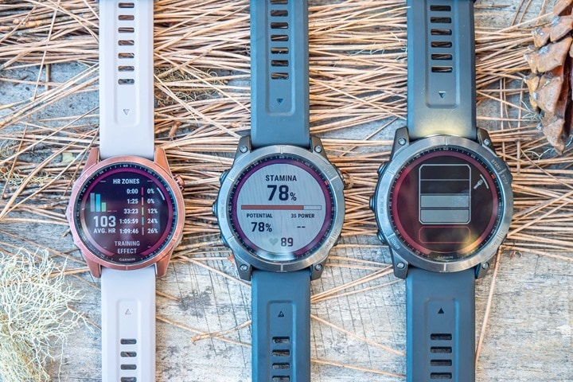

## Garmin Fenix 7S / 7 / 7X

The Fenix 7 range was released in 2022. The 7S (left) is the smaller model and 7X (right) is the larger model.

There is a Standard, Solar and Sapphire Solar edition of the Fenix 7S and 7. There are just Solar and Sapphire Solar for the 7X, making 8 watches in total. The only differences are the glass and the protective coatings on the metal parts.

Garmin have also added a "Windsurf" sport type and "SpeedPro" function for speedsurfers. It's fairly basic compared to the features on the COROS watches but a step in the right direction!

The watch also sports dual-frequency (multi-band) GNSS which is claimed to increase accuracy.

Details about the [Fenix 7S](https://www.garmin.com/en-GB/p/735542) + [Fenix 7](https://www.garmin.com/en-GB/p/735611) + [Fenix 7X](https://www.garmin.com/en-GB/p/735579) can be found on the Garmin website, plus the [manual](https://www8.garmin.com/manuals/webhelp/GUID-C001C335-A8EC-4A41-AB0E-BAC434259F92/EN-US/GUID-7CC6EB03-FE33-434B-9D69-F29CBB08C6F6-homepage.html).

### Tips

- Please read the general [guidance](../../../guidance.md) for all users of smart / sports watches.
- Change the data recording interval to "every second". The default is "smart" and is unsuitable for speed sailing.
- Export the session in the .FIT format in the Garmin Connect app. Do this using the "[original](https://support.garmin.com/en-GB/?faq=W1TvTPW8JZ6LfJSfK512Q8)" format.
- Try installing the [GPSTC data fields](https://www.haigh.id.au/GPSTC.htm) by TBWonder to monitor your best 2s, 10s, 5 x 10s, 1852m, alpha 500m and hour.

### Specifications

| Item                                                       | Details                                                      |
| ---------------------------------------------------------- | ------------------------------------------------------------ |
| Logging                                                    | 1 Hz when recording interval is set to "every second"        |
| Memory                                                     | TBC                                                          |
| Battery                                                    | 26 h (Fenix 7S) / 40 h (Fenix 7) / 63 h (Fenix 7X)           |
| Charging                                                   | Custom USB cable                                             |
| Download                                                   | Export from Garmin Connect                                   |
| Best Format                                                | [FIT](https://developer.garmin.com/fit/protocol/)            |
| Other Formats                                              | [GPX](https://en.wikipedia.org/wiki/GPS_Exchange_Format) + [TCX](https://en.wikipedia.org/wiki/Training_Center_XML) |
| GPS chipset                                                | [Airoha AG3335M](https://www.airoha.com/products/p/A0Dmm0pijWW3MScb) |
| Additional Logging                                         | No                                                           |
| Approved for [GP3S](https://www.gps-speedsurfing.com/)     | No                                                           |
| Approved for [GPSTC](https://www.gpsteamchallenge.com.au/) | No                                                           |
