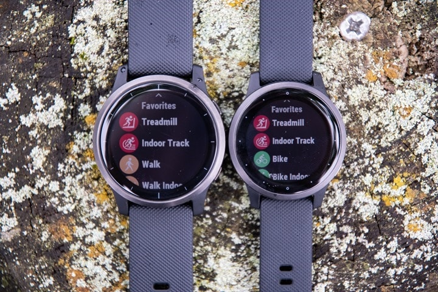

## Garmin Vivoactive 4 / 4S

The Vivoactive 4 was first released in 2019.

The Fenix 4 (left) is the standard model and Fenix 4S (right) is the smaller model.

Details about the [Vivoactive 4](https://www.garmin.com/en-GB/p/643382) can be found on the Garmin website, plus the [manual](https://www8.garmin.com/manuals/webhelp/vivoactive4_4S/EN-US/GUID-5F584975-CE56-49BF-A039-0E63B3ECF990-homepage.html).

### Tips

- Please read the general [guidance](../../../guidance.md) for all users of smart / sports watches.
- Change the data recording interval to "every second". The default is "smart" and is unsuitable for speed sailing.
- Export the session in the .FIT format in the Garmin Connect app. Do this using the "[original](https://support.garmin.com/en-GB/?faq=W1TvTPW8JZ6LfJSfK512Q8)" format.
- Try installing the [GPSTC data fields](https://www.haigh.id.au/GPSTC.htm) by TBWonder to monitor your best 2s, 10s, 5 x 10s, 1852m, alpha 500m and hour.

### Specifications

| Item                                                       | Details                                                      |
| ---------------------------------------------------------- | ------------------------------------------------------------ |
| Logging                                                    | 1 Hz when recording interval is set to "every second"        |
| Memory                                                     | TBC                                                          |
| Battery                                                    | 18 h (VA 4) / 15 h (VA 4S)                                   |
| Charging                                                   | Custom USB cable                                             |
| Download                                                   | Export from Garmin Connect |
| Best Format                                                | [FIT](https://developer.garmin.com/fit/protocol/)            |
| Other Formats                                              | [GPX](https://en.wikipedia.org/wiki/GPS_Exchange_Format) + [TCX](https://en.wikipedia.org/wiki/Training_Center_XML) |
| GPS chipset                                                | [Sony](https://www.sony-semicon.co.jp/e/products/lsi/gps/product.html) - probably the CXD5603GF |
| Additional Logging                                         | No                                                           |
| Approved for [GP3S](https://www.gps-speedsurfing.com/)     | No                                                           |
| Approved for [GPSTC](https://www.gpsteamchallenge.com.au/) | No                                                           |

