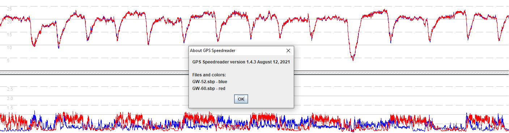

## General Tips - WIP

### Doppler vs Positional

Garmin Fenix 5 track from Mark is a good spike example  40 knots

Weird spikes on APEX Pro non-doppler.

Green overlay is much worse over 500m for APEX Pro.

Motion has much better positional speeds than APEX Pro.

Total time and distance most similar on Motion.

### FIT vs GPX

When exporting tracks for analysis, always choose the [FIT](https://developer.garmin.com/fit/protocol/) file format over [GPX](https://en.wikipedia.org/wiki/GPS_Exchange_Format).

- FIT files from sports watches tend to include Doppler speed in addition to latitude and longitude. FIT files also include metrics such as heart rate, temperature, etc.
- COROS have also added some useful GPS information to the FIT data, enabling run verification for GP3S; Satellites, COG, HDOP.
- GPX files contain latitude and longitude but not Doppler speed. Speeds calculated from positional data are less accurate than Doppler speeds and prone to "spikes".

### Wrist Watches

Far from ideal for GPS due to underhand / overhand and sail flips.

Greatly affects GW-60 and likely affects other watches.

Helmet, bicep or forearm is best.

Boom and wrist tend to show micro-accelerations caused by chop.

### Frequency

- Higher frequency units show higher acceleration.
  - 10Hz Motion > 5Hz GW-60 > 1Hz Coros
  - GPS Results 6.173 PC / 5.63 Mac changed maximum acceleration for 10Hz units to 10m/s².
- Higher frequencies have distances (m) closer to intended - e.g. 500.3m vs 503.8m.

Note that higher frequency logs take significantly longer to process in GPSResults - **TBC 6.185**

### Accuracy

#### Satellites

- GW-60; 6 to 9
- Coros; 11 to 13
- Motion; 16 to 18

n.b. It is unlikely that all of them will are used concurrently

Coros - https://www.seabreeze.com.au/forums/Windsurfing/Gps/Garmin-Fenix-7?page=1

Tests in a german windsurf forum showed that the use of Glonass (in combination with all the other possible systems) the Coros will measure signifiantly lower speeds. Up to 5 kmh in GPS results.

GPS-Speedsurfing:...In general it's good to use the GPS/QZSS setting (can be changed SYSTEM, MORE SETTINGS, MODE...)  

Speed Accuracy thread 

https://www.seabreeze.com.au/forums/Windsurfing/Gps/Speed-Accuracy

Garmin:

> It appears that the Garmin and Suunto GPS Watches use only positional data. What sometimes appears to be Doppler speed data in analysis programs, seems to actually be a smoothed or filtered Positional output.

#### SDOP

SDoP (speed dilution of precision) / sAcc (Speed accuracy) use closed source algorithms and are not directly comparable.

Tom's analysis - and thus the Sirf error-values - *are* 4 SD.... the analysis targeted > 99 percentile, so that we could be extremely confident of the error-bounds. TBC - did they mean 3?

SDOP is not in the .fit data exported by the COROS app.

Suspect it is also not uploaded to the COROS backend for GP3S.

SDOP is lower for Motion than GW-60, leading to smaller +/-

- GW-60; +/- 0.08
- Motion; +/- 0.02

sAcc

- Receiver protocol specifications
  - cm/s for "Speed accuracy estimate" in NAV-VELECEF messages, according to the ublox7 specs

#### sAcc

The u-blox GPS chips generate a speed accuracy metric (sAcc) which isn't dissimilar to SDOP on Locosys devices.

According to the u-blox 7 specification, "Speed accuracy estimate" appears in NAV-VELECEF messages and is measured in m/s.

sAcc is very consistent on the Motion Mini and usually suggests speeds are accurate to within +/- 0.5 knots.

sAcc > 1 should be regarded as bad data.

#### Max Speed

Really "max speed + noise"

#### Filters

- Maximum speed error (knots); 2.0 for 1 Hz, 4.0 for 5 Hz / 10Hz
  - Recommend using 1.0 for 5Hz / 10Hz - sailquick
  - Use 2.0 for GW-60 due to wrist mounting during gybes
- Maximum acceleration (m/s2); 4.0 @ 1 Hz, 8.0 @ 5 Hz, **10.0** @ 10 Hz
- Error propagation; average @ 1 Hz, Gaussian @ 5 Hz / 10 Hz

Gps SpeedReader

- Error estimates  
  - The default maximum allowed error estimate (SDoP or sAcc) is 2.0 for 1-Hz data, and 4.0 for 5 Hz and higher data.
- Acceleration  
  - The maximum allowed acceleration is 4.0 m/second squared for 1 Hz data; 8.0 for 5 Hz data; and **16.0** for 10 Hz data.

### Uncertainty

SDOP / sAcc (u-blox; speed accuracy)

Be careful comparing brands

- GW-52 is better than GW-60 which is the most uncertain. Both can be rather iffy!
  - Better antenna and view of Sky on GW-52
- GT-31 is more certain than GW-52 and GW-60
- GT-31 is comparable to Motion but more consistent on the Motion

Check out underhand / overhand grip in GW-60 track on 27 March.

- Also described in https://www.seabreeze.com.au/forums/Windsurfing/Gps/Speed-Accuracy

Awesome thread about accuracy, putting aside the occasional bickering!

http://seabreaze.com.au/forums/Windsurfing/Gps/Speed-Accuracy?page=3

> This is a very good example of why GPSTC does not allow posting from Phones or other non "Dopplar-Error" devices:
>
> 3 Motions all agreed well within the reported error margins. GPS-Logit, using the Android Phones internal GPS, was more than 1 knot out on the two best 2 second runs!!!
>
> There would have been no way to tell how wrong Logit was if not for the other devices worn. The satellite numbers were high for GPS unit (8 sats) and, HDoP was 0.2, which does not indicate any problems.

### GNSS

The 5 GNSS constellations:

- GPS (US)
- QZSS (Japan)
- BEIDOU (China)
- GALILEO (EU)
- GLONASS (Russia)

Link - [The 5 GNSS Constellations Explained](https://blog.bliley.com/the-differences-between-the-5-gnss-satellite-network-constellations)

### GPS Chipsets

Here is a very brief summary of popular GPS chips in sports watches:

- MediaTek 
  - MT3333 was favoured by Garmin between 2012 and 2018; Fenix 2 to Fenix 5.
- Sony
  - CXD5603GF was popular from 2018 to 2020; COROS, Garmin, Suunto, Polar
    - There was an Issue impacting positional [accuracy](https://www.dcrainmaker.com/2021/01/gps-accuracy-impacting-devices.html) in early 2021.
    - FIT files from the COROS APEX Pro exhibit a number of [issues](coros/data-issues.md).
- Airoha (subsidiary of MediaTek)
  - AG3335M has gained popularity since 2021; CORO VERTIX 2, Garmin Fenix 7, etc.

An article about the [performance](https://inf.news/en/fitness/a0e724b10c23386846c99d40c3ff225c.html) of mainstream sports watches provides more detail.

#### Antenna

It should be noted that data quality is not solely to do with the the GPS chip. The quality of the antenna and ground plane are equally important.

See Roo - https://www.seabreeze.com.au/forums/Windsurfing/Gps/GW-52-5-Hz-Spikes-are-noise

https://www.seabreeze.com.au/forums/Windsurfing/Gps/GW-52-5-Hz-Spikes-are-noise)

## References

[Dilution of Precision](https://en.wikipedia.org/wiki/Dilution_of_precision_(navigation)) on WIkipedia

[SDOP](https://nujournal.net/estimating-accuracy-of-gps-doppler-speed-measurement-using-speed-dilution-of-precision-sdop-parameter/) paper written by Tom Chalko in 2009

[Kalman Filter](https://en.wikipedia.org/wiki/Kalman_filter) on WIkipedia

[Dead Toys and Lots of Noise](https://boardsurfr.blogspot.com/2016/07/dead-toys-and-lots-of-noise.html?utm_source=seabreeze.com.au) blog about 5Hz noise on GW-52

​	[GW-52 5 Hz Spikes are noise](
