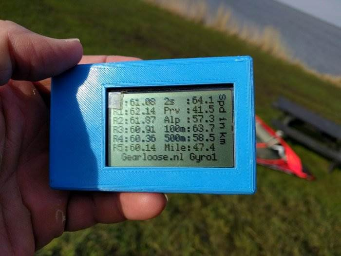

## Gyro1

The Gyro1 provides superior data quality compared to the popular [Locosys](../locosys/README.md) devices and modern smart / sports watches from the likes of COROS, Garmin, Suunto and Polar.

The u-blox [NEO-M8Q](https://www.u-blox.com/en/product/neo-m8-series) GNSS module provides high accuracy positional, speed and verification data at 10 Hz or 18 Hz, depending on the GPS systems being used.

This was the first GPS device utilising a u-blox 8 to be officially [approved](https://www.gps-icesailing.com/default.aspx?mnu=forum&forum=6&val=108406) by GP3S. The history of the device and how it was developed can be found on [Windsurfing.nl](https://forum.windsurfing.nl/viewtopic.php?f=62&t=13890429).

Further details for the [Gyro1](https://gearloose.nl/) can be found on the Gearloose.nl website, including a page to generate [configuration](https://gearloose.nl/gps.html) files.

### Specifications

| Item                                                       | Details                                                      |
| ---------------------------------------------------------- | ------------------------------------------------------------ |
| Logging                                                    | 1 Hz, 5 Hz, 10 Hz or 18 Hz                                   |
| Memory                                                     | Micro SD card - up to 32 GB                                  |
| Battery                                                    | 24 hours                                                     |
| Charging                                                   | TBC                                                          |
| Download                                                   | TBC                                                          |
| Best Format                                                | UBX                                                          |
| Other Formats                                              | n/a                                                          |
| GPS chipset                                                | u-blox [NEO-M8Q](https://www.u-blox.com/en/product/neo-m8-series) module |
| Additional Logging                                         | Sats, HDOP, sAcc                                             |
| Approved for [GP3S](https://www.gps-speedsurfing.com/)     | [Yes](https://www.gps-icesailing.com/default.aspx?mnu=forum&forum=6&val=108406) |
| Approved for [GPSTC](https://www.gpsteamchallenge.com.au/) | No                                                           |
