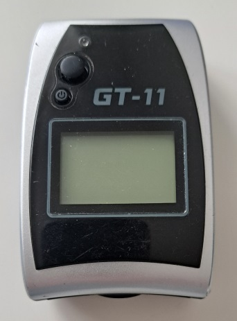

## Locosys GT-11

The [GT-11](https://web.archive.org/web/20100430102528/http://www.locosystech.com:80/product.php?zln=en&id=5) was released by Locosys in 2006 and it can still be found on the Wayback Machine.

It was the original benchmark for quality 1 Hz logging at an affordable price!

In addition to the positional data (latitude and longitude) it recorded Doppler speed, COG, HDOP and satellite counts.

It was also sold as NAVI GPS by NAVMAN and the [Amaryllo Trip Tracker](https://www.amaryllo.com/almooj/sports-products/amaryllo-trip-tracker-gps-sports-device-7.html) by Amaryllo.

You can find some details about it in my [feature comparison](../../../guidance/features/feature-comparison.pdf), last updated in Jul 2010.

### Tips

- Always answer "Y" when asked the question "MOVE LONG?". This is necessary to ensure accurate logging.
- Always answer "Y" when asked the question "INDOORS?". This will disable logging until the receiver is taken outside.

### Specifications

| Item                                                       | Details                                        |
| ---------------------------------------------------------- | ---------------------------------------------- |
| Logging                                                    | 1 Hz                                           |
| Memory                                                     | ~2 hours (internal) but much more with SD card |
| Battery                                                    | >24 hours                                      |
| Charging                                                   | Mini USB cable                                 |
| Download                                                   | SD card or mini USB cable + NAVILINK           |
| Best Formats                                               | SiRF binary (SBN) or SiRF binary, packed (SBP) |
| Other Formats                                              | NMEA                                           |
| GPS chipset                                                | SiRFstar II                                    |
| Additional Logging                                         | Sats, HDOP                                     |
| Approved for [GP3S](https://www.gps-speedsurfing.com/)     | No                                             |
| Approved for [GPSTC](https://www.gpsteamchallenge.com.au/) | No                                             |

