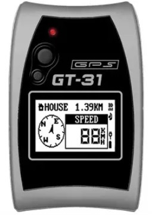

## Locosys GT-31

Details about the [GT-31](https://www.locosystech.com/en/product/gps-handheld-data-logger-gt-31.html) can still be found on the Locosys website.

This was a significant improvement to the [GT-11](../gt-11/README.md), thanks to use of a newer GPS chipset from SiRF:

- Faster satellite acquisition; time to first fix (TTFF).
- Increased positional accuracy.
- Less prone to spikes in Doppler speed data.
- Longer battery life.

[SDOP](https://nujournal.net/estimating-accuracy-of-gps-doppler-speed-measurement-using-speed-dilution-of-precision-sdop-parameter/) became available for the first time, allowing the Doppler speed accuracy to be estimated with 99% certainty.

The GT-31 was superseded by the [GW-52](../gw-52/README.md) in 2015, when Locosys stopped producing the GT-31.

### Tips

- Enable DGPS (SBAS) for improved positional accuracy.

### Specifications

| Item                                                       | Details                                                      |
| ---------------------------------------------------------- | ------------------------------------------------------------ |
| Logging                                                    | 1 Hz                                                         |
| Memory                                                     | ~5h 30m (internal) but much more with SD card                |
| Battery                                                    | ~40 hours                                                    |
| Charging                                                   | Mini USB cable                                               |
| Download                                                   | SD card or mini USB cable + NAVILINK                         |
| Best Formats                                               | SiRF binary (SBN) or SiRF binary, packed (SBP)               |
| Other Formats                                              | n/a                                                          |
| GPS chipset                                                | [SiRFstar III](https://en.wikipedia.org/wiki/SiRF#SiRFstarIII) |
| Additional Logging                                         | Sats, HDOP, SDOP                                             |
| Approved for [GP3S](https://www.gps-speedsurfing.com/)     | [Yes](https://www.gps-speedsurfing.com/default.aspx?mnu=item&item=GTx) |
| Approved for [GPSTC](https://www.gpsteamchallenge.com.au/) | [Yes](https://www.gpsteamchallenge.com.au/pages/rules)       |
