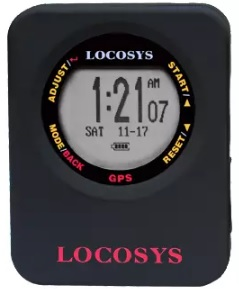

## Locosys GW-52

Details about the [GW-52](https://www.locosystech.com/en/product/gps-handheld-data-logger-gw-52.html) can still be found on the Locosys website.

You can also find details about the device in my [first impressions](first-impressions.md), written in Nov 2015.

The GW-52 superseded the [GT-31](../gt-31/README.md) in 2015, when Locosys stopped producing the earlier model.

### Tips

- Although an option exists in the GW52Util, do not convert the SBP files to GPX format.
  - The SBP format contains all of the important GPS error information!

### Specifications

| Item          | Details                       |
| ------------- | ----------------------------- |
| Logging       | 1 Hz or 5 Hz                    |
| Memory        | ~35h @ 1 Hz or ~7h @ 5 Hz |
| Battery       | ~8 hours @ 5 Hz                |
| Charging      | Micro USB cable               |
| Download      | Micro USB cable + GW52Util    |
| Best Format   | SiRF binary, packed (SBP)     |
| Other Formats | n/a                           |
| GPS chipset   | probably the [SiRFstar IV](https://www.qualcomm.com/products/application/automotive/positioning-solutions/sirfstar-iv-4e) |
| Additional Logging | Sats, HDOP, SDOS |
| Approved for [GP3S](https://www.gps-speedsurfing.com/) | [Yes](https://www.gps-speedsurfing.com/default.aspx?mnu=item&item=GTx) |
| Approved for [GPSTC](https://www.gpsteamchallenge.com.au/) | [Yes](https://www.gpsteamchallenge.com.au/pages/rules)      |

### Observations

- [SDOP](https://nujournal.net/estimating-accuracy-of-gps-doppler-speed-measurement-using-speed-dilution-of-precision-sdop-parameter/) on the GW-52 is typically lower than on the [GW-60](../gw-60/README.md) watch, possibly due to a larger antenna and better shielding.
