## GW-52 – First Impressions

**Originally published on 25 November 2015.**

I’ve recently acquired a GW-52 and having used it a few times, decided to write an article sharing my experiences. It is by no means a full technical evaluation but I still have a fair bit of information to share after a few simple trials. This article describes some key points about the GW-52 and how it compares to its predecessor the GT-31.

### PHYSICAL UNIT

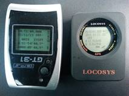

The GT-31 and GW-52 both have a waterproof rating of IPX7 and an Aqua Pac is advised for both devices. Since the GW-52 has less places for water / moisture to penetrate it may be slightly more tolerant of a leaky Aqua Pac but this is pure speculation on my part.

The GW-52 is fractionally smaller than the GT-31 and is operated via touch screen. The device has 5 pressure sensors and they are clearly labelled with yellow/red text. It’s worth noting that the touch screen works fine when inside an Aqua Pac. The touch screen of the GW-52 is also easier to operate inside an Aqua Pac than the joystick of the GT-31.

The unit itself is never off as such and pressing the screen at wakes the device up in time mode. This mode is where device settings such as “Logging” and “Speed Genie” can be changed. The time mode also has features such as an alarm, stop watch and timer. Pressing START and GPS together will switch on the GPS and lock the controls ready to go sailing.

### FIRMWARE

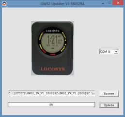

The GW-52 shipped with firmware V1.0G1120B but has subsequently been upgraded to V1.2G0529.

- V1.1G0209A added “SPD HISTORY”, showing the best speeds of the session after each run

-  V1.2G0529 added “SCROLL SEC”, allowing the Speed Genie pages to be shown for longer

The latest [GW-52 Updater](https://www.locosystech.com/en/product/gps-handheld-data-logger-gw-52.html) and Firmware revisions are available from the Locosys website.

### SETUP

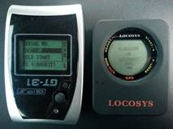

The GW-52 only has a few settings but it offers everything of importance from the GT-31:

- **LOGGING** – “OFF”, “1HZ”, “5HZ” or “SMART”… more on this later!

- **MIN SPEED** – “0” to “15”… prevents low speeds from being recorded

- **UNIT** – “KM” (KPH), “MI” (MPH), “NM” (KTS)

- **GMT** – Specify time zone with support for 30 minute differences

- **SPEED AVG** – e.g. “10” will display 10 second averages in addition to peak speeds

- **SPEED GENIE** – e.g. “20” deems a new run to start when 20 knots is exceeded

- **ACTION SPD** – “SPEED” or “NS AVG”… show current speed or 10s average during each run

- **SPD FONT** – “BIG” or “SMALL”. “SMALL” reports peak speed and 10s average simultaneously

- **SPD HISTORY** – “ON” or “OFF”. “ON” shows session bests as well as the last run. **FW V1.1**

- **SCROLL SEC** – “1S”, “1.5S”, “2.0S” OR “2.5S”. Slows down the display after each run. **FW V1.2**

- Device information – Firmware version, serial number, username, etc.

Note: Only **LOGGING**  and **MIN SPEED** affect what is eventually shown on a computer whereas the other options only affect what is shown on the device itself.

 ### STARTUP

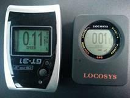

The GW-52 is slightly quicker than the GT-31 when it comes to acquiring a satellite lock; approximately 30 seconds (GW-52) compared to 60 seconds (GT-31) for a “cold start”.

When observing both GPS devices at rest they never say zero, showing fluctuating readings but the GW-52 is typically lower than that of the GT-31. The GW-52 also shows a horizontal bar indicating the accuracy of speed measurements (SDOP/SDOS).

Resetting the top 10 speeds to zero is straightforward before going sailing. It is also possible to clear the existing log so that the next computer download will only include data from the latest session.

 ### SAILING

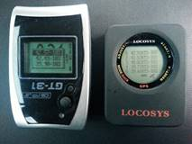

Whilst sailing the GW-52 behaves in much the same way as the GT-31. Whilst travelling at speed the GW-52 will display current speed or N second average, according to the ACTION SPD. After each run the GW-52 will show the peak speed / N second average and firmware V1.1 / V1.2 will also show the best speed(s) of the session.

It is worth noting that the Speed Genie of the GW-52 will often show higher speeds than a computer once the track has been downloaded. This is because the Speed Genie is updating at 5Hz even if the data is being logged at 1Hz.

Reviewing the best runs of the session is slightly better on the GW-52. The picture above shows how five results are displayed at a time on the GW-52 in comparison with three results on the GT-31. Five results is ideal for reviewing the session average (5x10s) and the GW-52 is also easier to operate than the GT-31 when inside an Aqua Pac.

Note: Screen contrast is slightly lower on the GW-52 so it may be harder to read in an Aqua Pac.

 ### MEMORY

The GT-31 and GW-52 both have a circular memory which wraps around when full:

- GT-31 = 16,190 data points, approx. 4h30m@1Hz

- GW-52 = 129,024 data points, approx. 35h50m@1Hz or 7h10m@5Hz

The GT-31 also allows data to be written to SD-CARD which offers greater capacity and is also a pretty convenient way of downloading data onto a computer.

Setting the MIN SPEED to “1” means that the GW-52 will only record data whilst moving and the capacity at 1Hz can then be considered to be 36 hours of movement.

 ### BATTERY

The battery life of the GT-31 was pretty remarkable for a handheld GPS device and it didn’t require charging every session. It could easily have lasted for around 36 hours in total.

The battery life of the GW-52 is approximately 8 hours when logging at 5Hz. Logging at 1Hz may extend the battery life by about an hour and charging takes about 2.5 hours after a full discharge.

This reminds me of way-back when I switched from a simple Nokia mobile phone with a battery life in excess of a week to a smart phone which needed to be charged every day… progress?

Whilst the battery life of the GW-52 will be sufficient for most people during a typical session it will clearly be a problem for people wanting to attempt 24 hour speed records.

 

### USB CONNECTOR

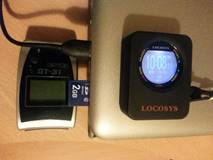        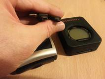

A significant difference between the GT-31 and GW-52 is the lack of an SD CARD on the GW-52.

Downloading data from the GW-52 to a computer must be done via the USB connector. Whilst this was possible on the GT-31 it was very slow and the software was a little clunky. Fortunately the interface is much faster on the GW-52 and the software is a lot better.

Note: The GT-31 uses the mini USB connector whilst GW-52 uses the (newer) micro USB connector.

Locosys provide [instructions](https://www.locosystech.com/en/product/gps-handheld-data-logger-gw-52.html) and videos which explain how to open the USB cover.

 

### DOWNLOAD

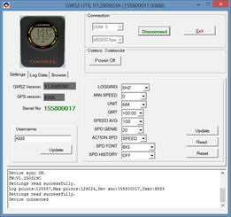         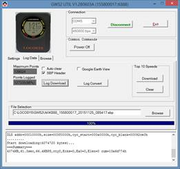

The GW-52 Utility allows the GW-52 settings to be reviewed/changed and log data to be downloaded to a computer. It is easy to use but only runs on Windows; I’ve used it on Windows 7 and 8.1 without any problems. Tech-savvy Mac users might wish to try running it within a VM, Boot Camp or under Wine. If these names / acronyms mean nothing to you they’re clearly not an option and you’ll need access to a Windows machine.

Download speeds (via USB) are 50-80 times faster on the GW-52:

- GT-31 is 9,600 bps – full log (4.5h @ 1Hz) takes 6 minutes. i.e. 80s per hour of sailing

- GW-52 is 460,800 bps – full log (35h50m @ 1Hz) takes 1 minute. i.e. 1s per hour of sailing

The latest [GW-52 Utility](https://www.locosystech.com/en/product/gps-handheld-data-logger-gw-52.html) is available from the Locosys website.

 

### ANALYSIS @ 1HZ

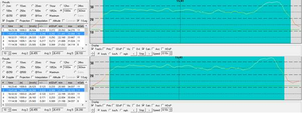

Weymouth session comparing GT-31 (top) and GW-52 @1Hz (bottom) over 1000m.

Traces look near-identical and mSDOP is comparable, practically the same level of accuracy.

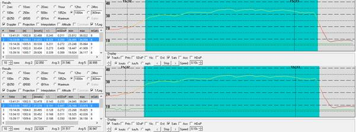

Southend-on-Sea session comparing GT-31 (top) and GW-52 @1Hz (bottom) over 1000m.

Traces look near-identical and mSDOP is comparable, practically the same level of accuracy.

 

### ANALYSIS @ 5HZ

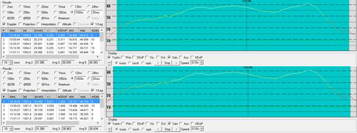

Southend-on-Sea session comparing GT-31 (top) and GW-52 @5Hz (bottom) over 1000m.

Notice how the mSDOP values are 2.6 times higher on the GW-52, implying the individual readings are less accurate. The GW-52 trace is more jagged and emphasises the inaccuracy of the individual readings. 

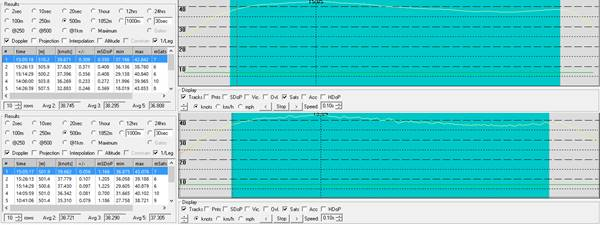

West Kirby session comparing GT-31 (top) and GW-52 @5Hz (bottom) over 500m.

Notice how the mSDOP values are 3.2 times higher on the GW-52, implying the individual readings are less accurate. The GW-52 trace is more jagged and emphasises the inaccuracy of the individual readings. 

 

### INTERPRETATION

The nature of the physics, electronics and mathematics relating to GPS technology dictates that the accuracy of an individual readings will decrease when sampling rate is increased. This appears to be evident in the GW-52 when the logging is changed from 1Hz to 5Hz.

To rule out the possibility of chop being a cause for inaccuracies (or indeed the track being an accurate representation of bouncing over chop) a further test recording was done in a car. It showed the same differences in mSDOP values and the same jagged traces even on smooth roads.

Whilst it is possible for the jagged traces to be smoothed out in software it does not seem hugely advantageous to have five readings per second if they are inherently less accurate than one reading per second. Computer software can smooth the data and report error levels but it is not clear if the end result will be any more accurate.

 

### SUMMARY

The GW-52 is a nice device and possibly a little better than the GT-31 whilst selling for a similar price. If you have been planning to buy a GT-31 or need to replace a broken GT-31 then the GW-52 is probably for you, putting aside Mac support. If you already have a GT-31 which you are happy with it probably isn’t worth rushing out to buy a GW-52 as an upgrade.

Until the accuracy of 5Hz logging is better understood, 1Hz is probably advisable. 1Hz is comparable to the GT-31 and will increase the GW-52 memory capacity from 7h10m (5Hz) to 35h50m (1Hz). The time taken to download via USB will be reduced and the processing time in GPSResults / GpsarPro will also be reduced.

 

### LINKS

Locosys [page](https://www.locosystech.com/en/product/gps-handheld-data-logger-gw-52.html).

First impressions [video](https://www.youtube.com/watch?v=1Y0Akxo91sQ) by Tristan Haskins of GPS Speed - 8 May 2015: 
