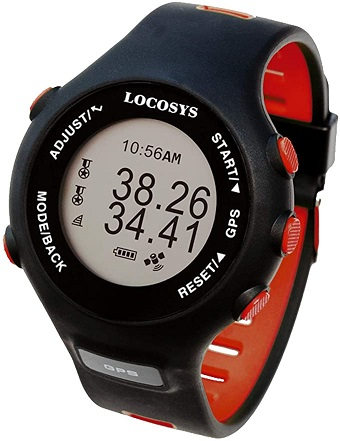

## Locosys GW-60

Details about the [GW-60](https://www.locosystech.com/en/product/GPS-Doppler-Watch-GW-60/gps-watch-gw-60.html) can still be found on the Locosys website.

In many ways it is comparable to the [GW-52](../gw-52/README.md) but it has the added convenience of being a wrist watch. It also has slightly better functionality for reviewing speed results during and after the session.

Convenient as it was to have a wrist watch, the GW-60 was prone to water ingress and operating it via the buttons during a session ultimately lead to its demise!

### Specifications

| Item          | Details                                |
| ------------- | -------------------------------------- |
| Logging       | 1Hz or 5Hz                             |
| Memory        | TBC but somewhat larger than the GW-52 |
| Battery       | ~5 hours @ 5Hz                         |
| Charging      | Custom USB cable                       |
| Download      | Custom USB cable + GW60Util            |
| Best Format   | SiRF binary, packed (SBP)              |
| Other Formats | n/a                                    |
| GPS chipset   | MediaTek, possibly the MT3318          |
| Approved for [GP3S](https://www.gps-speedsurfing.com/) | [Yes](https://www.gps-speedsurfing.com/default.aspx?mnu=item&item=gw60) |
| Approved for [GPSTC](https://www.gpsteamchallenge.com.au/) | [Yes](https://www.gpsteamchallenge.com.au/pages/rules)      |

### Observations

- [SDOP](https://nujournal.net/estimating-accuracy-of-gps-doppler-speed-measurement-using-speed-dilution-of-precision-sdop-parameter/) on the GW-60 is typically higher than on the [GW-52](../gw-52/README.md), possibly due to the smaller antenna and poorer shielding.
- Beware the effect of underhand grip as it increases error levels; higher SDOP.
  - Detail about this can be found in a test [session](../../../sessions/20220327/README.md) on 27 Mar 2022.
- You would be well advised not to press any buttons during a session!
  - Water ingress will eventually destroy the GW-60.

