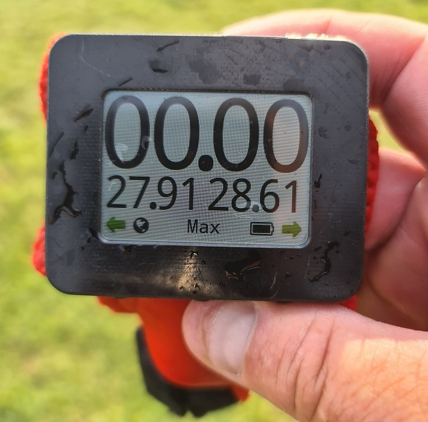

## Motion LCD

The Motion LCD provides superior data quality compared to the popular [Locosys](../../locosys/README.md) devices and modern smart / sports watches from the likes of COROS, Garmin, Suunto and Polar.

The u-blox GNSS chip combined with Motion's custom filters, amplifier and oscillator provide high accuracy positional, speed and verification data at 10 Hz. Units built prior to July 2022 used the [UBX-M8030-KT](https://www.u-blox.com/en/product/ubx-m8030-series) chip whilst units since July 2022 have used the [UBX-M10050-KB](https://www.u-blox.com/en/product/ubx-m10050-chip) chip. The only real difference between the two GNSS chips are their power consumption and thus battery life.

Unlike the Motion Mini this device has a screen for on-the-water feedback.

Further details for the [Motion LCD](https://www.motion-gps.com/motion/documentation.html) can be found on the Motion GPS website.

### Specifications

| Item                                                       | Details                                                      |
| ---------------------------------------------------------- | ------------------------------------------------------------ |
| Logging                                                    | 1 Hz, 2 Hz,  5 Hz or 10 Hz                                   |
| Memory                                                     | 8 GB                                                         |
| Battery                                                    | ~32 hours @ 10 Hz (UBX-M8030-KT) xx hours @ 10 Hz (UBX-M10050-KB) |
| Charging                                                   | Wireless                                                     |
| Download                                                   | WiFi - connect to built-in webserver                         |
| Best Format                                                | [OAO](https://www.motion-gps.com/motion/documentation/oao-file-format.html) |
| Other Formats                                              | [GPX](https://en.wikipedia.org/wiki/GPS_Exchange_Format) - 1 Hz |
| GPS chipset                                                | [UBX-M8030-KT](https://www.u-blox.com/en/product/ubx-m8030-series) [UBX-M10050-KB](https://www.u-blox.com/en/product/ubx-m10050-chip) |
| Additional Logging                                         | Sats, HDOP, sAcc                                             |
| Approved for [GP3S](https://www.gps-speedsurfing.com/)     | [Yes](https://www.gps-speedsurfing.com/default.aspx?mnu=item&item=gpsother) |
| Approved for [GPSTC](https://www.gpsteamchallenge.com.au/) | [Yes](https://www.gpsteamchallenge.com.au/pages/rules)       |

### Tips

- Be sure to update the time zone (via the settings) when clocks change.
  - This only affects filenames and times reported by the internal webserver.
  - Logging will always use UTC timestamps.
- Have a look at my [WiFi tips](../wifi.md) if you can't access the built-in webserver from your phone.
