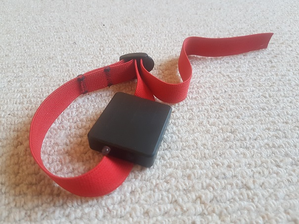

## Motion Mini

The Motion Mini provides superior data quality compared to the popular [Locosys](../../locosys/README.md) devices and modern smart / sports watches from the likes of COROS, Garmin, Suunto and Polar.

The [UBX-M8030](https://www.u-blox.com/en/product/ubx-m8030-series) GPS chip combined with Motion's custom filters, amplifier and oscillator provide high accuracy positional, speed and verification data at 10Hz.

The device has no screen as it is purely designed to be a high-accuracy logging device. It is very reasonably priced and is perfect for anyone who cares about the accuracy of their data.

I have written up my [first impressions](first-impressions.md) of the Motion Mini in a short article.

Further details for the [Motion Mini](https://www.motion-gps.com/motion/documentation.html) can be found on the Motion GPS website.

### Specifications

| Item          | Details                                                      |
| ------------- | ------------------------------------------------------------ |
| Logging       | 1Hz, 2Hz,  5Hz or 10Hz                                       |
| Memory        | 8 GB                                                         |
| Battery       | ~14 hours @ 10Hz                                             |
| Charging      | Contactless                                                  |
| Download      | WiFi - connect to built-in web server                        |
| Best Format   | OAO                                                          |
| Other Formats | GPX - 1Hz                                                    |
| GPS chipset   | u-blox [UBX-M8030](https://www.u-blox.com/en/product/ubx-m8030-series) |

