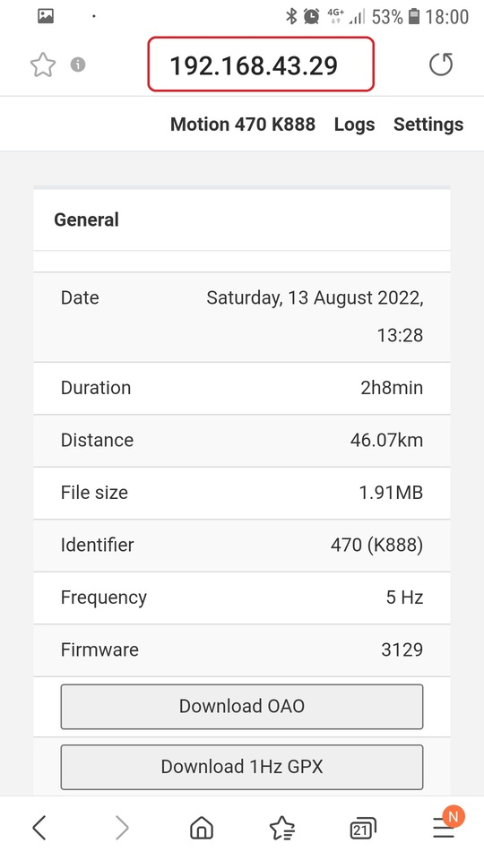

## Motion WiFi Tips

### Background

The Motion LCD and Mini have a built-in webserver to download tracks, review speeds, etc.

Firmware 3106 (and newer) provides three basic methods via which the built-in webserver can be accessed:

1. The Motion can create its own WiFi for devices such as phones, tablets or laptops.
2. The Motion can be connected to an existing WiFi such as a home or public network.
3. The Motion can be connected to a mobile hotspot.

I'll briefly explain how these options work and then describe a workaround which may be used with problematic mobile devices.

### Method 1

Connect your computer / tablet / phone to the Motion's WiFi and access the build-in webserver using one of the following URLs:

- http://192.168.01/
- http://motion-xxx/ where xxx is the numerical ID of the Motion

This method works fine for all of my laptops (Windows 11) and old tablet (iPad gen 3) but not my phone (Samsung Galaxy S7).

### Method 2

Connect your Motion to an existing WiFi and access the build-in webserver using the following URL:

- http://motion-xxx/ where xxx is the numerical ID of the Motion

This method works fine for all of my laptops (Windows 11) and old tablet (iPad gen 3) but not my phone (Samsung Galaxy S7).

### Method 3

Connect your Motion to your mobile hotspot and access the build-in webserver using the following URL:

- http://motion-xxx/ where xxx is the numerical ID of the Motion

This method works fine for all of my laptops (Windows 11) and old tablet (iPad gen 3) but not my phone (Samsung Galaxy S7).

### Workaround

You may have noticed that none of the methods described above work with my phone!

However, I've discovered a workaround that allows the built in webserver to be accessed from my mobile phone.

This is only possible with firmware 3106 (and newer) which introduced connection to regular WiFi networks.

Step 1 - Switch on the mobile hotspot on the phone.

Step 2 - Connect the Motion to the hotspot by switching on the Motion and then pressing the main button 3 times.

This requires prior configuration of the Motion; specifying the SSID + password in the Motion config.

Step 3 - Click on the connected device (e.g. motion-470)

Step 4 - Make a note of the IP address which will likely begin with 192.168.

Step 5 - Type the Motion's IP address into the browser on your phone.

Step 6 - At the bottom of the page you will see useful information such as battery charge.

Step 7 - The list of sessions can be viewed by clicking on "Logs" at the top of the page.

Step 8 - When clicking on a session date / time you can then download the OAO file, ready for uploading to [GPS-Speedsurfing.com](https://www.gps-speedsurfing.com/).

Step 9 - You can also see a selection of the speed results, corresponding to the categories on [GPS Team Challenge](https://www.gpsteamchallenge.com.au/).

### Wrap Up

I've not gone into detail about how to set up the Motion itself but I think this workaround will prove useful to some people.

My mobile phone cannot access the built-in webserver using the standard methods but the workaround does the trick.

It's essentially a case of identifying the IP address of the Motion and accessing it directly.

Good luck...