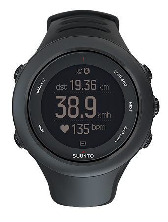

## Suunto Ambit3

Details about the [Ambit3](https://www.suunto.com/en-gb/Products/sports-watches/Suunto-Ambit3-Sport/Suunto-Ambit3-Sport-Black/) can still be found on the Suunto website, plus the [manual](https://ns.suunto.com/Manuals/Ambit3_Sport/Userguides/Suunto_Ambit3_Sport_UserGuide_EN.pdf).

The Ambit3 range was first released in 2014 and the range includes sport, run, peak and vertical models.

It includes smartphone connectivity which is a handy way to download the session data.

Tips:

- Set the GPS accuracy to "best" for ~1 second interval; see section 3.18.3 of the manual.
- Download the session as a .FIT file using the Suunto app for [Android](https://www.suunto.com/en-gb/Support/faq-articles/suunto-app/how-do-i-download-a-.fit-file-from-suunto-app-for-android/) or [iOS](https://www.suunto.com/en-gb/Support/faq-articles/suunto-app/how-do-i-download-a-.fit-file-from-suunto-app-for-ios/).

### Specifications

| Item                                                       | Details                                                     |
| ---------------------------------------------------------- | ----------------------------------------------------------- |
| Logging                                                    | ~1 Hz when GPS accuracy is set to "best"                    |
| Memory                                                     | TBC                                                         |
| Battery                                                    | 10 - 20 hours, depending on the model                       |
| Charging                                                   | Custom USB cable                                            |
| Download                                                   | Download from the Suunto app                                |
| Best Format                                                | [FIT](https://developer.garmin.com/fit/protocol/)           |
| Other Formats                                              | [GPX](https://en.wikipedia.org/wiki/GPS_Exchange_Format)    |
| GPS chipset                                                | [SiRF Star V](https://en.wikipedia.org/wiki/SiRF#SiRFstarV) |
| Approved for [GP3S](https://www.gps-speedsurfing.com/)     | No                                                          |
| Approved for [GPSTC](https://www.gpsteamchallenge.com.au/) | No                                                          |
