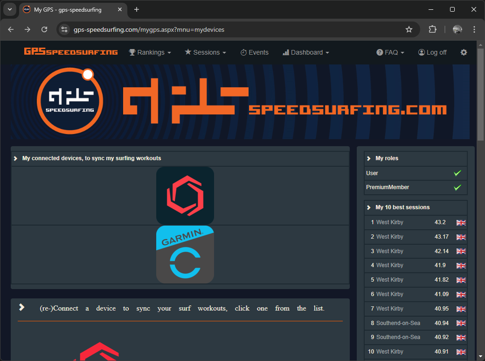
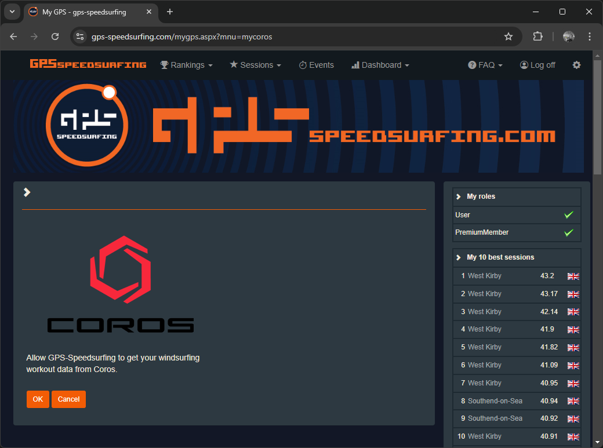

## Linking Accounts

It is possible to link your COROS account to other websites, such as GPS-Speedsurfing, Hoolan, Waterspeed, Strava, and Relive.

This will ensure that your sessions are automatically uploaded to these websites, without doing manual data exports and data imports.

Some of the more popular choices are described in the following sections.

### GPS-Speedsurfing

You can link your COROS account to [GPS-Speedsurfing](https://www.gps-speedsurfing.com/) (GP3S) using the [My Devices](https://www.gps-speedsurfing.com/mygps.aspx?mnu=mydevices) page.

This is quickly demonstrated in a short video on [YouTube](https://www.youtube.com/watch?v=a6jI8dON5OI), should you require further assistance.

Dashboard -> My Items -> My Devices

Select the COROS option under (re-)Connect a device which will then walk you through the process, probably requiring you to confirm your COROS username + password.

Once the connection process has been completed all of your subsequent watersports sessions will automatically be uploaded to GP3S, allowing you to quickly post to any of the GP3S sites.

What actually happens is the FIT files for your sessions are automatically processed by GP3S, whereby obvious spikes are removed. However, some spikes (especially Sony GNSS chipset) can slip through the filters.

### Hoolan + Waterspeed

[Hoolan](https://www.hoolan.app/) and [Waterspeed](https://waterspeedapp.com/) are popular apps for Apple watch (and iPhone) owners. Hoolan and Waterspeed can both be linked to a Garmin Connect account, ensuring that watersport activities are automatically uploaded to their platforms.

This capability doesn't exist for COROS watches right now, but might become available in the future. I'm not privy to any information saying that this will ever happen, just saying that it is theoretically possible!

### Strava + Relive

You can link your COROS account to [Strava](https://www.strava.com/) and [Relive](https://www.relive.cc/), but I feel obliged to provide a warning. Strava does NOT know how to process the speed data recorded by your COROS watch and can therefore result in fictitious speeds.

If you want to know why, Strava does not process the [Doppler-derived speeds](https://medium.com/@mikeg888/the-importance-of-doppler-b886b14bb65d) from the GPS / GNSS chipset and is therefore prone to producing spikes. These spikes may be small (e.g. just a few knots), or large (e.g. tens of knots).

Strava is great as an activity diary, recording where you sailed and how far, but you should really disregard any of the max speeds being reported. Sadly, you can't just remove the obvious spikes and assume the rest of the speeds are good.

## Next Page

[Watch usage](../usage/README.md)

- Wearing the watch, recording an activity, additional tips
