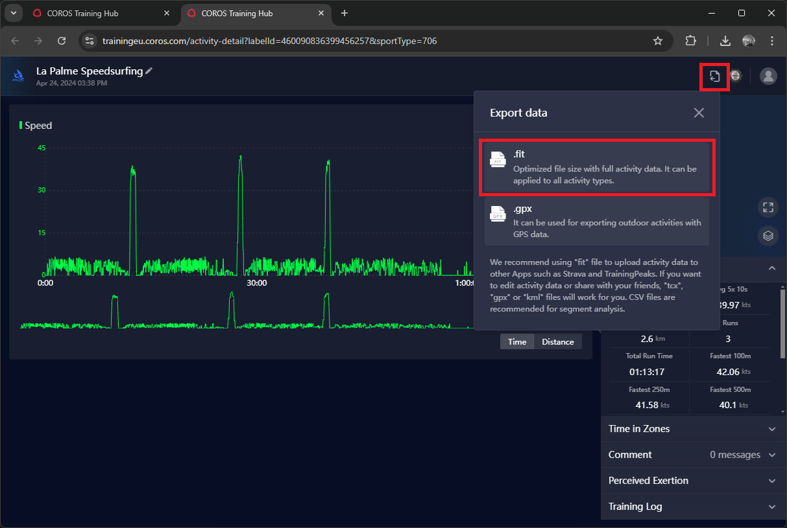
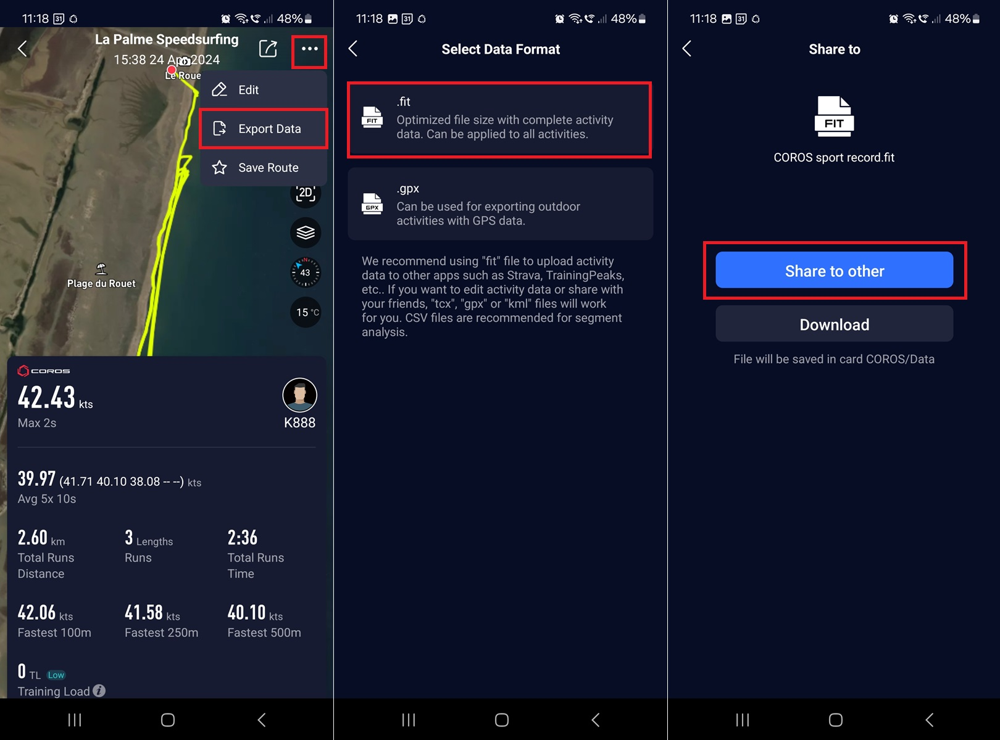

## Data Analysis

Hopefully you've already set up your watch correctly and have recorded a session using the speedsurfing activity.

The speedsurfing activity provides some nice feedback during the session, so you will already have a good idea of your results.

Once you are off the water, your watch will send all of the data to your phone where it can be reviewed in the COROS app.

If you've linked your COROS account to GPS-Speedsurfing, Hoolan or Waterspeed then the session will also be uploaded to those sites, completely automatically.

### Exporting Activities

If you haven't linked your COROS account to GPS-Speedsurfing, Hoolan or Waterspeed then you may need to manually export your data.

The most important point is to export as a FIT file, not GPX. The GPX format is great for route planning and navigation, but not speed analysis.

In a nutshell, GPX doesn't have an agreed way to exchange [Doppler-derived speeds](https://medium.com/@mikeg888/the-importance-of-doppler-b886b14bb65d) which makes it unsuitable for speed analysis.

You can export the FIT file by logging in to the [COROS Training Hub](https://trainingeu.coros.com/admin/views/activities) on your computer and exporting the data.

You can also export the FIT file from within the COROS phone app. You can also share it with people via e-mail, Messenger, WhatsApp, etc.

A couple of final notes:

- Large spikes will often be filtered by COROS and somewhat lessened in data exports.
  - Personally, I'd prefer for the original data to be exported, allowing the downstream processing to handle it accordingly.
- You should avoid the temptation to convert from FIT to GPX using tools such as GPSBabel.
  - The conversion process can introduce artificial speeds (even spikes) and therefore undesirable.

### Laptop Analysis

I would encourage you to have a look at your sessions on a laptop, giving you some insight into your sailing and to keep an eye on the performance of your watch.

This is particularly important with unapproved devices such as the PACE 2 or PACE 3, because it allows you to looks for any obvious spikes.

These are the best applications for Garmin speed analysis:

- [GPSResults](https://www.gps-speed.com/download_e.html) by Manfred Fuchs - 30 day trial, Windows
- [GPS Speedreader](https://github.com/prichterich/GPS-Speedreader/) by Peter Richterich - unrestricted, Windows + Mac

Unfortunately, [GpsarPro](http://gpsactionreplay.free.fr/index.php?menu=2) by Yann Mathet does not support the FIT format.

### Importing Activities

If you haven't linked your COROS account to GPS-Speedsurfing, Hoolan or Waterspeed then you may wish to manually import your data.

The most important point is to import a FIT file from your watch, not GPX. This was discussed earlier in the section "Exporting Activities".

It is perfectly fine to upload FIT files to GPS-Speedsurfing because it knows how to process your speeds correctly.

Some of the other platforms may be prone to exaggerating your speeds:

- Waterspeed is currently unable to import FIT files and it ignores the Doppler speeds in GPX files produced by COROS.
- Strava can import FIT files but it ignores the Doppler-derived speeds and thus prone to over-reporting and spikes.
- SportsTrackLive ignores the Doppler-derived speeds and thus prone to over-reporting and spikes.
- Relive is also popular, but I have not tried it and cannot comment on whether it handles speeds correctly.

## Next Page

[Known issues](../issues/README.md)
