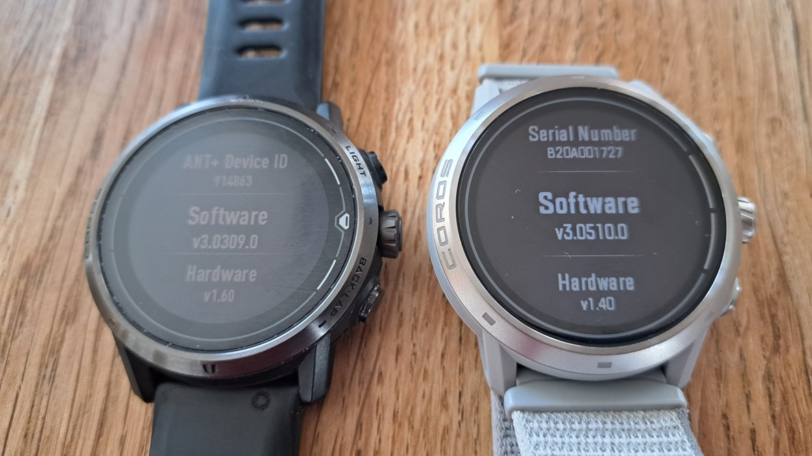
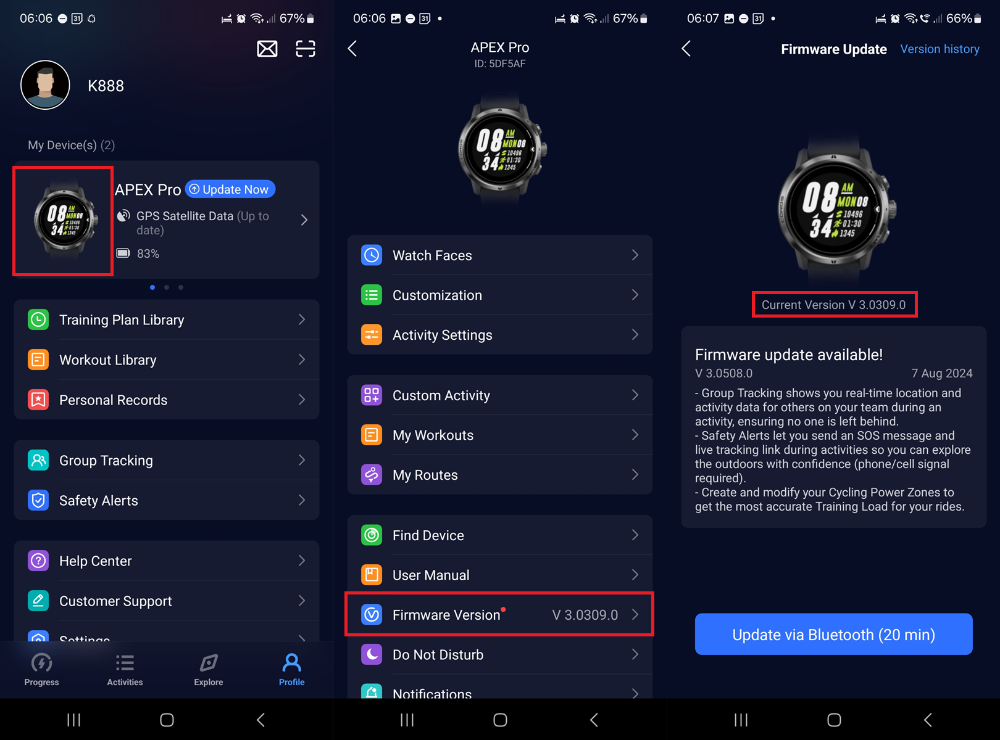
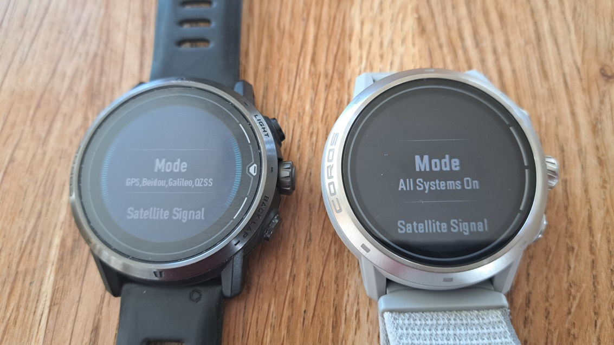
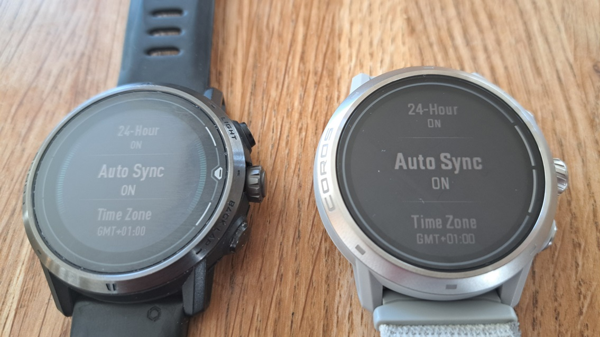

## Watch Setup

### Firmware

The firmware version is of particular importance with the COROS watches. You can check which version you have installed on the watch itself.

System -> More Settings -> Device Info -> Software

**IMPORTANT** - recent firmware releases have been detrimental to the accuracy / reliability of COROS watches. Those issues are being worked on right now!

- APEX Pro + VERTIX
  - 3.0309.0 and 3.0409.0 were good versions, so keep them installed.
  - DO NOT upgrade to 3.0508.0
- APEX 2 + APEX 2 Pro + VERTIX 2 / 2S
  - 3.0308.0 was the last good version, so keep it installed.
  - DO NOT upgrade to 3.0408.0, 3.0409.0, 3.0508.0 or 3.0510.0

You can also check the firmware version from within the COROS application, but be wary of the available upgrades!

**TOP TIPS**

- If you have 3.0508.0 on your APEX Pro or VERTIX you can downgrade to 3.0309.0 by following the [instructions](https://support.coros.com/hc/en-us/articles/15344945273620-How-to-manually-update-my-COROS-watch) from COROS.
- If you have 3.0308.0 or earlier on APEX 2 / APEX 2 Pro / VERTIX 2 / VERTIX 2S then leave it installed at this time.
- You should re-check your GPS / GNSS settings after every firmware update because they have a tendency to revert to standard GPS.

### Watch Settings

The GPS / GNSS mode has far more impact than you might think. The default mode of standard GPS gives longer battery life, which is great for ultra-running or endurance-cycling, but far more likely to report fictitious speeds.

The worst errors that I have seen from the Airoha-based COROS watches have occurred when using the standard GPS mode. It's really important that you use All Systems or Dual Frequency on the latest watches.

If you have one of the older Sony-based watches then you should choose one of the modes which uses multiple systems, and not just standard GPS. Personally, I use GPS + BeiDou + Galileo + QZSS.

System -> More Settings -> Satellite Systems -> Mode

The time of day on COROS watches can start to drift quite quickly, but this can be avoided by ensuring [auto-sync](https://support.coros.com/hc/en-us/articles/5859961688212-The-watch-is-not-displaying-the-correct-time) is switched on. The time will then be kept up-to-date by the COROS app.

System -> More Settings -> Date / Time -> Auto Sync

These are some other settings that I would recommend / advise:

- System -> Activity Interface
  - Auto Scroll = off / on, depending on personal preference
- System -> Wi-Fi
  - Add for manual sync, and faster downloads of maps + newer firmware
- System -> More Settings
  - Gesture Backlight = off, avoiding the bright light when sleeping!
  - Touch Screen = map only, since it can behave eratically when wet
- System -> More Settings -> Auto Lock
  - Standby Mode = hold to unlock, since it is easier than using the dial
  - Activity Mode = hold to unlock, since it is easier than using the dial

Prior to starting the activity you can also change the following settings:

- Speed into a Run
  - 12 knots or 22 km/h
- Speed Units
  - knots or km/h
- Activity Alert
  - New Record Alert = on

Within the COROS app you can also configure the speedsurfing activity:

- Activity data pages
  - Set according to personal preference(s)
- Button settings
  - Set according to personal preference(s)
- Activity alert
  - New Record Alert = on

Notes:

- The COROS settings are clearly described in the [guide](https://drive.google.com/file/d/1YQbuPNeTJ3ivgykGI4qOz2yzMxxHmD9B/view?usp%3Dsharing) by Ingolf van Oostveen.
- You should re-check your GPS / GNSS settings after every firmware update!

### Watch Apps

COROS watches do not benefit from third party applications, like Apple or Garmin watches.

If you have a watch that includes speedsurfing and windsurfing activities, you should use the speedsurfing activity.

If you are using an APEX, PACE 2 or PACE 3 then GPS cardio is probably your best bet. You should avoid custom activities.

Activity modes will be discussed in the section "Recording an Activity".

## Next Page

[Linked accounts](../accounts/README.md)

- GP3S, Hoolan, Waterspeed, Strava, Relive

