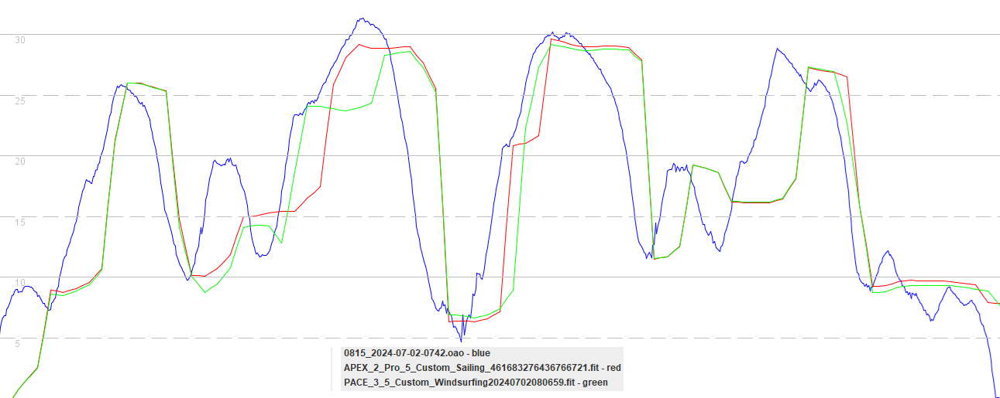
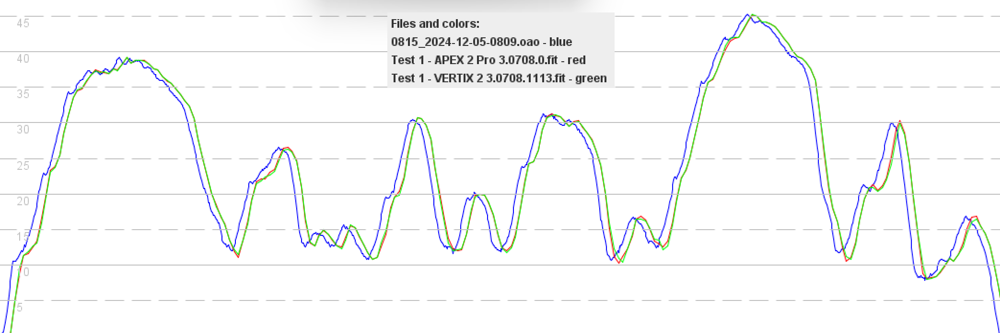

## Watch Usage

Sadly we don't live in a simple world where your GPS is either working, or not working. GPS errors vary in magnitude and the presence of a speed on the display does not mean the watch is operating correctly, or whether it is accurate.

The unfortunate downside of only considering max speeds is their susceptibility to errors. For example, during a routine test session my APEX Pro recently reported a max of [37.88](https://www.facebook.com/michael.george.545/posts/10220672656646659) knots when I was wingfoiling, instead of the actual 23 knots!

Aside from the quality of the GNSS chipset and antenna inside your watch, how you use the watch will influence the quality + accuracy of its results. Settings have already been discussed, so this section will focus on general usage.

### Wearing the Watch

How you wear your GPS watch can significantly impact the accuracy and reliability of the data being recorded. Fortunately, you can reduce the likelihood of errors by following some simple advice.

The basic goal is to ensure that your watch has a clear view of the sky for as much of the time as possible, especially during speed runs:

- Do not stuff your GPS down your wetsuit, inside your buoyancy aid, or inside a backpack. This can result in a complete loss of data during some (or all) of the session and will very likely impact the accuracy.
- Try to wear the GPS device over your wetsuit / rash vest, or at least fold back your sleeve. The watch only has a tiny antenna and if you cover it in wet neoprene / lycra the signal can be degraded, affecting the accuracy.
- When speed sailing, wearing your watch on your back hand will ensure that it is facing upwards. Alternatively, wear it underneath your wrist on your front hand, so that it is facing upwards when sailing with an underhand grip.

These points may seem nitpicky, but they really do make a difference to the overall performance of GPS watches. Whilst evaluating various Garmin watches, we saw poor quality data as a result of watches underneath neoprene.

### Recording an Activity

#### Firmware and Settings

Due to various [issues](https://logiqx.github.io/gps-details/devices/coros/firmware/) introduced by COROS during 2024, please check that you are using an appropriate firmware:

- APEX / VERTIX
  - Use [3.0309.0](https://logiqx.github.io/gps-details/devices/coros/firmware/3.0309.0/install.html), 3.0408.0 or 3.0409.0
  - Avoid 3.0508.0
- APEX 2 + APEX 2 Pro
  - Use 3.0706.0 or newer
  - Avoid 3.04xx.0, 3.05xx.0
- VERTIX 2 + VERTIX 2S
  - Use 3.0808.0 or newer
  - Avoid 3.04xx.0, 3.05xx.0, 3.07xx.0

Ensure you are using the correct watch settings:

- It should be using multiple systems, not standard GPS.
- It should have latest GPS data, which speeds up the initial signal acquisition.

#### Activity Mode

It is important to note that different activity modes implement their own unique filtering and smoothing. The implementation of each activity is unique to the watch manufacturer and this page shows the "custom" activity of COROS for illustrative purposes.

The image below compares speeds from an APEX 2 Pro (red) and PACE 3 (green) against a 5 Hz [Motion](https://www.motion-gps.com/) GPS (blue). The terrible accuracy from both watches is very clear, and entirely due to use of the "custom" activity. The custom activity is unsuitable for windsurfing / wingfoiling / kitesurfing!

Contrast this to the speedsurfing mode on the APEX 2 Pro (red), VERTIX 2 (green) and 5 Hz Motion GPS (blue). Aside from a small delay the COROS watches are pretty close to the Motion GPS (blue), and faithfully capturing the true speed.

This article will not describe all of the COROS activities, but VERTIX 2 spikes are often associated with use of the windsurfing mode (which is very different to speedsurfing) and the use of standard GPS (not multi-GNSS).

Summary:

- Use the speedsurfing activity for the best possible accuracy.
  - Do NOT use the windsurfing activity which is [non-Doppler](https://medium.com/@mikeg888/the-importance-of-doppler-b886b14bb65d).
- Use the GPS cardio activity on watches such as the APEX, PACE 2, PACE 3, PACE Pro.
  - Do not use the “custom” activities as the data is absolutely terrible, as illustrated earlier.

### Additional Tips

To ensure the crown dial and buttons do not seize up:

- Regularly clean the watch body as described by [COROS](https://support.coros.com/hc/en-us/articles/4407431266836-COROS-Watches-Maintenance-and-Cleaning-Tips).

Handy everyday tips:

- The backlight can provide some illumination in complete darkness.
- [Find my phone + find my watch](https://support.coros.com/hc/en-us/articles/6174368045588-Find-My-Phone-Find-My-Watch) can be super-useful when they are misplaced.

Additional tips:

- You can control your action camera from some of the COROS watches.
  - GoPro - COROS help on [control](https://support.coros.com/hc/en-us/articles/4411031553044-How-to-control-GoPro-Cameras) + article by [GoPro](https://gopro.com/en/gb/news/open-gopro-coros).
  - Insta360 - COROS help on [control](https://support.coros.com/hc/en-us/articles/4406181409300-How-to-control-Insta360-from-your-COROS-watch) + [data overlay](https://support.coros.com/hc/en-us/articles/28945366751764-Insta360-Data-Overlay).
- Learn to [save your location](https://support.coros.com/hc/en-us/articles/360055691511-Using-Waypoints-and-Saved-Locations) by holding the "back" button to open the toolbox menu.
  - This could be useful if you lose something at sea, perhaps if your foil breaks!
  - You can then return to the same spot with a mask + snorkel, or a diver.

## Next Page

[Data analysis](../analysis/README.md)

- Reviewing results, exporting activities, importing activities

