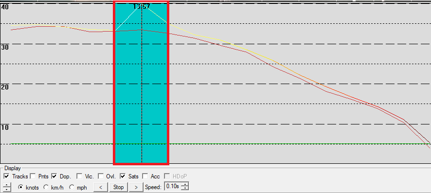
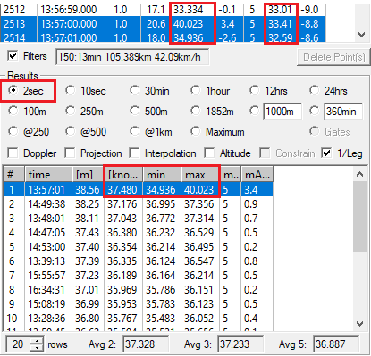

## Doppler-derived Speed

Author: Michael George

Created: Jan 2023

### Estimation of Position and Speed

You may have heard the term "Doppler Speed" and wondered what it is and why it is important when speed sailing?

GPS devices typically calculate their position and their speed independently, using two entirely different approaches\*:

- In principle, estimation of position (latitude, longitude and altitude) uses a method of [trilateration](https://en.wikipedia.org/wiki/Trilateration). This uses the [pseudo-ranges](https://en.wikipedia.org/wiki/Pseudorange) of the satellites, simply derived from the time for the radio signals to travel from the satellites to the receiver. You may have seen running / cycling tracks that do not follow the road and even go through neighboring buildings. This happens because the calculation of position is somewhat prone to errors caused by atmospheric effects, satellite [ephemeris](https://en.wikipedia.org/wiki/Ephemeris) errors, delayed / reflected signals (non-line-of-sight and multipath) and more besides.
- Estimated speed is independent of the estimated position and typically uses the observed [doppler shift](https://en.wikipedia.org/wiki/Doppler_effect) (change in carrier frequency) caused by the relative motions of the satellites and the receiver. Determination of the Doppler shift is a vital component of the tracking loops within GNSS receivers and although the Doppler observable exhibits some [noise](https://en.wikipedia.org/wiki/Noisy_data) / [jitter](https://en.wikipedia.org/wiki/Jitter) it is far more reliable than the [pseudo-range](https://en.wikipedia.org/wiki/Pseudorange) data. Doppler-derived speed is almost always more accurate / reliable than positional speed because it is less prone to errors caused by atmospheric effects, delayed / reflected signals, etc.

It should also be noted that the explanation above is a huge oversimplification of what really happens inside a GPS / GNSS chip. In reality, both of the approaches described typically necessitate the use of a [Least Squares](https://en.wikipedia.org/wiki/Least_squares) approximator or [Kalman filter](https://en.wikipedia.org/wiki/Kalman_filter) within the GPS / GNSS chip. Most modern receivers make use of a Kalman filter which is essentially an iterative mathematical process to produce the most likely estimate of the true value from [noisy](https://en.wikipedia.org/wiki/Noisy_data) sensor data. This involves making predictions using manufacturer-specific, proprietary "system models" (typically making use of the laws of motion) and a refinement of those predictions using the available sensor readings (GNSS observables) and estimates of the uncertainty levels.

\* Technically speaking the calculation of position and speed aren't entirely independent. A Kalman filter may also consider the velocity (speed and course) when estimating position. Likewise the estimation of velocity using the observable Doppler-shift needs to know the approximate position of the receiver in order to determine the line-of-sight vector between the satellite and the receiver. At the simplest level though, we can regard the calculation of position and speed to be completely independent processes. Most importantly, speed estimates aren't simply derived from positional estimates and more often-than-not will be based on the observable Doppler shift(s).

### Doppler Speed vs Positional Speed

Spikes often occur in speeds derived from positional estimates, whereas Doppler-derived speeds are far less susceptible to such spikes. The example below illustrates an obvious spike caused by the derivation of speed from positional data.

The screenshot below is from a Garmin Fenix 5. The graph shows the Doppler-derived speed (shown in red) vs the speed calculated from positional data (shown in yellow). The non-Doppler data shows a peak of 40 knots, whilst the Doppler-derived speed shows a peak of 33 knots.

Looking at the individual figures it can be seen how the speed derived from positional data jumped from 33 knots to 40 knots and back to 34 knots. At that same time the Doppler-derived speed barely changed, averaging around 33 knots. The 2 second speed derived from positional data was 37 knots whilst the Doppler-derived results was around 33 knots. That's an error of 4 knots which someone might try to claim for their 2 second result.

A GW-60 was also worn at the same time and confirmed that 33 knots was indeed the correct speed. Such spikes can be quite obviously wrong (e.g. 70 knots on a windsurfer) or more  subtle, simply being a few knots higher than the reality. Whilst spikes can also occur in Doppler-derived speeds they are far less common and typically rather less extreme.

### Summary

GPS / GNSS chips typically produce estimates of position and speed using two different approaches. Estimation of position uses pseudo-ranges and the method of trilateration, whereas speed is typically estimated using the observable Doppler shifts. The Doppler observable is a lot less susceptible to errors than the pseudo-range observable so the estimated speed is typically a lot more accurate than estimated position (and speeds derived from positions).

The chips will often make use of a Kalman filter and thus be based on proprietary models / predictions, and not just simple sensor readings based on the time taken for radio signals to travel from the satellite to the receiver. Doppler-derived speed estimates will almost always be more accurate / reliable than speeds that are have been derived from the positional estimates. Doppler-derived estimated speeds should therefore be used in preference to the non-Doppler speeds derived from positional data.

To ensure the Doppler-derived speeds are used it is typically necessary to use FIT files from sports watches, rather than GPX files. A separate [article](../fit/README.md) discusses the difference between FIT and GPX in more detail.

