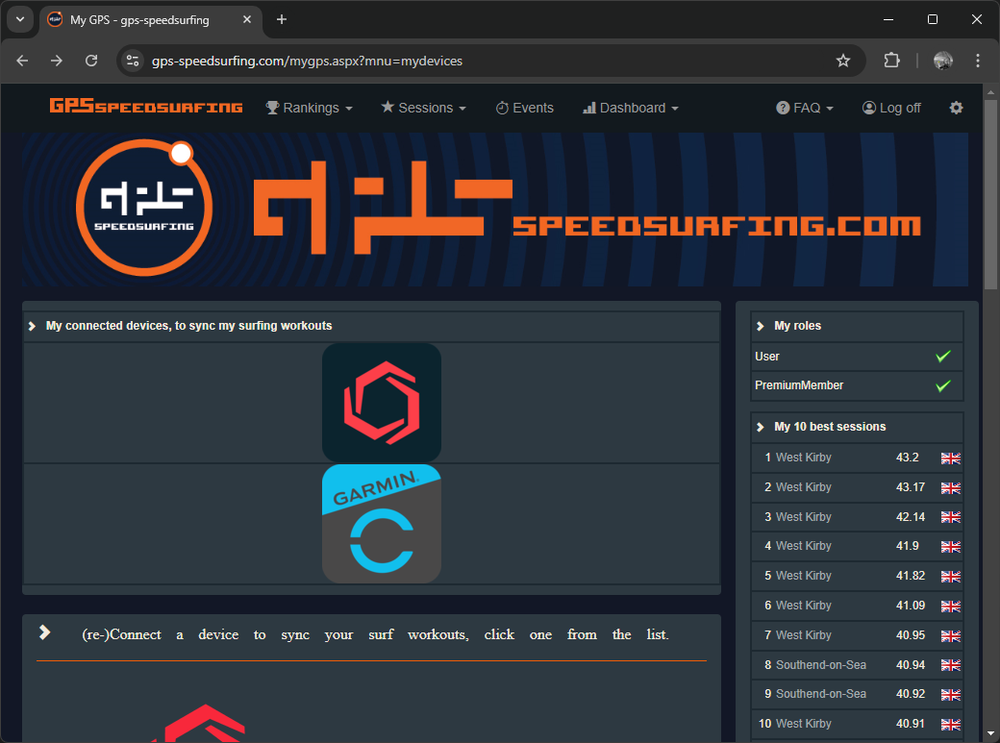

## Linked Accounts

It is a good idea to link your Garmin account to other websites, such as GPS-Speedsurfing and Hoolan or Waterspeed.

This will ensure that your sessions are automatically uploaded to these websites, without doing manual data exports and data imports.

Some of the more popular choices are described in the following sections.

### GPS-Speedsurfing

You can link Garmin Connect to [GPS-Speedsurfing](https://www.gps-speedsurfing.com/) (GP3S) using the [My Devices](https://www.gps-speedsurfing.com/mygps.aspx?mnu=mydevices) page.

This is demonstrated in a short video on [YouTube](https://www.youtube.com/watch?v=a6jI8dON5OI) which might be helpful.

Dashboard -> My Items -> My Deviceshttps://www.gps-speedsurfing.com/mygps.aspx?mnu=mydevices)

Select the Garmin option under (re-)Connect a device which will then walk you through the process, probably requiring your registered Garmin Connect username and password.

Once the connection process has been completed your watersports sessions will automatically be uploaded to GP3S, allowing you to quickly post to any of the GP3S sites.

What actually happens is the FIT files for your sessions are processed by GP3S, whereby obvious spikes are removed. However, some spikes (especially Sony GNSS chipset) can slip through the filters.

### Hoolan + Waterspeed

Hoolan and Waterspeed are popular apps with Apple watch users. Hoolan and Waterspeed can both be linked to your Garmin Connect account, ensuring that watersport activities are automatically uploaded to their platforms.

### Strava + Relive

You can link your Garmin Connect account to Strava and Relive, but I feel obliged to provide a warning. Strava does NOT know how to process the speed data recorded by your Garmin watch and can therefore result in fictitious speeds.

If you want to know why, Strava does not process the [Doppler-derived speeds](https://medium.com/@mikeg888/the-importance-of-doppler-b886b14bb65d) from the GPS / GNSS chipset and therefore prone to spikes. These spikes may be small (e.g. just a few knots), or large (e.g. tens of knots).

Strava is great as an activity diary, recording where you sailed and how far, but you should really disregard any of the max speeds being reported. No, you can't just eyeball the data and remove obvious spikes yourself...

## Next Page

[Watch usage](../usage/README.md)

- Wearing the watch, recording an activity, additional tips
