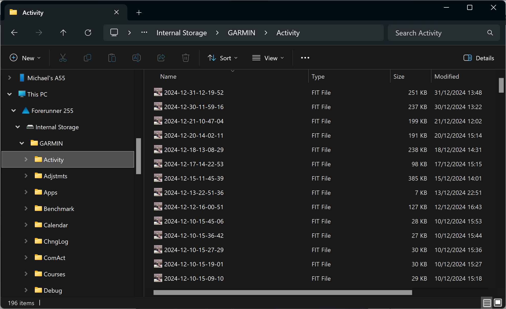

## Data Analysis

Hopefully you've already set up your watch correctly and have recorded a session using an app such as [APPro](https://apps.garmin.com/apps/9567700b-6587-44be-9708-879bfc844791).

APPro provides some really nice feedback during the session, so you will already have a good idea of your results.

Once you are off the water, your watch will send all of the data to your phone where it can be reviewed in Garmin Connect.

If you've linked your Garmin Connect account to GPS-Speedsurfing, Hoolan or Waterspeed then the session will also be uploaded to those sites, completely automatically.

### Exporting Activities

If you haven't linked your Garmin Connect account to GPS-Speedsurfing, Hoolan or Waterspeed then you may need to manually export your data.

The most important point is to export as a FIT file, not GPX. GPX is fine for route planning and navigation, but not speed analysis.

In a nutshell, GPX doesn't have an agreed way to exchange [Doppler-derived speeds]((https://medium.com/@mikeg888/the-importance-of-doppler-b886b14bb65d)) which makes GPX highly undesirable, although thoroughly [documented](https://logiqx.github.io/gps-wizard/gpx/).

You can export the FIT file by logging in to [Garmin Connect](https://connect.garmin.com/modern/activities) on your computer and exporting the data.

You can also export the FIT file using the web browser on your smartphone, in much the same way as on a computer.

One final way to copy the FIT files from your watch is to connect the watch to your computer using the USB charge cable and navigating to the Garmin Activity folder.

A couple of final notes:

- The exports from Garmin Connect are actually [ZIP](https://en.wikipedia.org/wiki/ZIP_(file_format)) files which contain a single FIT file.
  - You may need to extract the FIT file before uploading to sites such as GPS-Speedsurfing or Hoolan.

- You should avoid the temptation to convert from FIT to GPX using tools such as GPSBabel.
  - The conversion process can introduce artificial speeds (even spikes) and therefore undesirable.

### Laptop Analysis

I would encourage you to have a look at your sessions on a laptop, giving you some insight into your sailing and to keep an eye on the performance of your watch.

This is particularly important with unapproved devices such as the fēnix 6 and Instinct 2, because it allows you to looks for any obvious spikes.

These are the best applications for speed analysis, listed in alphabetical order:

- [GpsarPro](http://gpsactionreplay.free.fr/index.php?menu=2) by Yann Mathet - 60 day trial, Windows + Mac
- [GPSResults](https://www.gps-speed.com/download_e.html) by Manfred Fuchs - 30 day trial, Windows
- [GPS Speedreader](https://github.com/prichterich/GPS-Speedreader/) by Peter Richterich - unrestricted, Windows + Mac

### Importing Activities

If you haven't linked your COROS account to GPS-Speedsurfing, Hoolan or Waterspeed then you may wish to manually import your data.

The most important point is to import a FIT file from your watch, not GPX. This was discussed earlier in the section "Exporting Activities".

It is perfectly fine to upload FIT files to GPS-Speedsurfing because it knows how to process your speeds correctly.

Some of the other platforms may be prone to exaggerating your speeds:

- Waterspeed is currently unable to import FIT files, but the GPX files produced by Garmin do not include the Doppler speed data.
- Strava can import FIT files but it ignores the Doppler-derived speeds and thus prone to over-reporting and spikes.
- SportsTrackLive ignores the Doppler-derived speeds and thus prone to over-reporting and spikes.
- Relive is also popular, but I have not tried it and cannot comment on whether it handles speeds correctly.

## Next Page

[Known issues](../issues/README.md)
