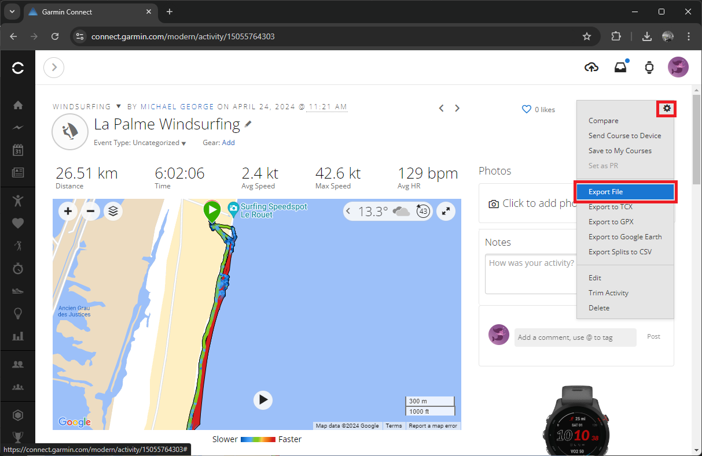
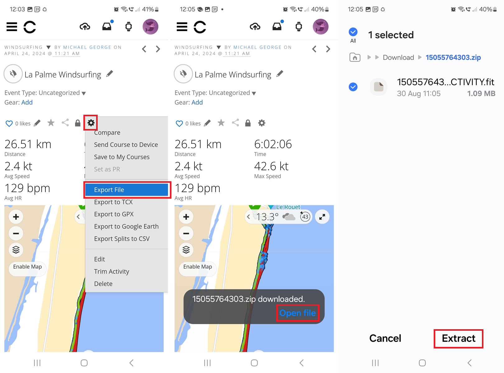

## Data Analysis

### Reviewing Results

Ignore max and take 2s with a pinch of salt, compare to 10s / 100m / 250m

- [GPSResults](https://www.gps-speed.com/download_e.html) by Manfred Fuchs
- [GpsarPro](http://gpsactionreplay.free.fr/index.php?menu=2) by Yann Mathet
- [GPS Speedreader](https://github.com/prichterich/GPS-Speedreader/) by Peter Richterich

### Exporting Activities

- Export FIT - actually a ZIP file

App - web browser

Explain ZIP and warn against converting to GPX with GPSBabel.

### Importing Activities

- Import to suitable platform
  - GP3S using FIT
  - Ignore Strava and SportsTrackLive
    - Don't know about Relive which is also popular
  - Waterspeed will import GPX but not suitable for Garmin

## Next Page

[Known issues](../issues/README.md)
