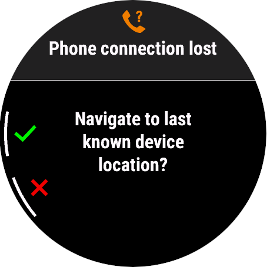
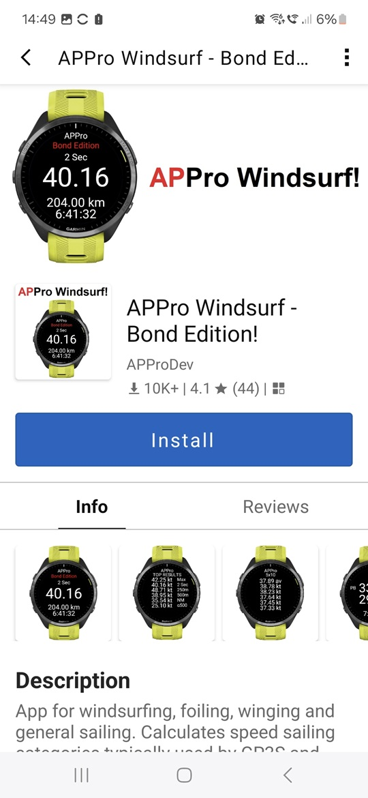

## Watch Setup

### Firmware

Unlike the COROS watches that have experienced numerous firmware issues since the middle of 2024, you don't really need to worry about accidentally installing a bad firmware on your Garmin.

Simply ensure that you are using the latest firmware version that is available by opening the Garmin Connect application on your phone, opening "System" and selecting "Software Update". 

### Watch Settings

#### Data Recording

It is important that data recording is set to every second, rather than the Garmin default which is called "smart" recording. This option can be found in the system settings.

This can be achieved on the watch itself, or in the Garmin Connect application on your phone. 

#### Satellite Settings

The GPS / GNSS mode has far more impact than you might think. The standard GPS setting gives longer battery life, which is great for ultra-running or endurance-cycling, but far more likely to report erroneous speeds.

The worst errors that I have seen from GPS watches have occurred when using standard GPS mode. It's therefore important that you use the most appropriate multi-GNSS setting on your watch.

General advice:

- Airoha chipset
  - All Systems + Multi-Band, or All Systems
- Sony or MediaTek chipset
  - GPS + Galileo is preferable to GPS + GLONASS

#### Automatic Date and Time

Your Garmin can automatically set the time to match your phone, but be sure that your phone is using the date and time provided by the network. On Android phones this option is called "automatic date and time", but "set automatically" is also available on the iPhone.

Assuming your phone is set to use the network date and time then your watch will always be showing the correct time, assuming the watch setting also set to "auto". If your watch and / or phone time is wrong then it can affected the logging and your GPS track may use inaccurate timestamps.

#### Find My Phone Alerts

You may wish to disable [Find My Phone Alerts](https://support.garmin.com/en-GB/?faq=rQd3VdvlHj78fOJ9V4Uz19) if you sometimes see the following screen appearing on your watch, whilst you are on the water!

A related option called [Phone Connection Alerts](https://support.garmin.com/en-GB/?faq=NVd6I8uPsl4NkIqyM8dh99) is disabled by default, and probably best left disabled.

#### Touch Screen

Some watches have a touch screen which can behave erratically during watersport activities. This can be disabled in the system settings, or toggled by pressing / holding the "down" and "start" buttons.

### Watch Apps

You will need to install a suitable app on your watch but most people won't find anything better than [APPro](https://apps.garmin.com/apps/9567700b-6587-44be-9708-879bfc844791?tid=0) for keeping track of their speeds. Simply open the Garmin Connect IQ app on your phone, search for "APPro" then click "Install".

  

APPro is very simple to use and will ensure that your watch is using the most appropriate GNSS setting(s) and activity mode. The app will also display a "run report" after each run, whether you have come to a stop, or tacked / gybed. 

Basic instructions for APPro are available on the Connect IQ store. You may wish to change the selections for field 1 + field 2 (perhaps "2 sec" and "10 sec") and speed units, but most of the default settings should suit most users. 

## Next Page

[Linking accounts](../accounts/README.md)

- GP3S, Hoolan, Waterspeed, Strava, Relive

