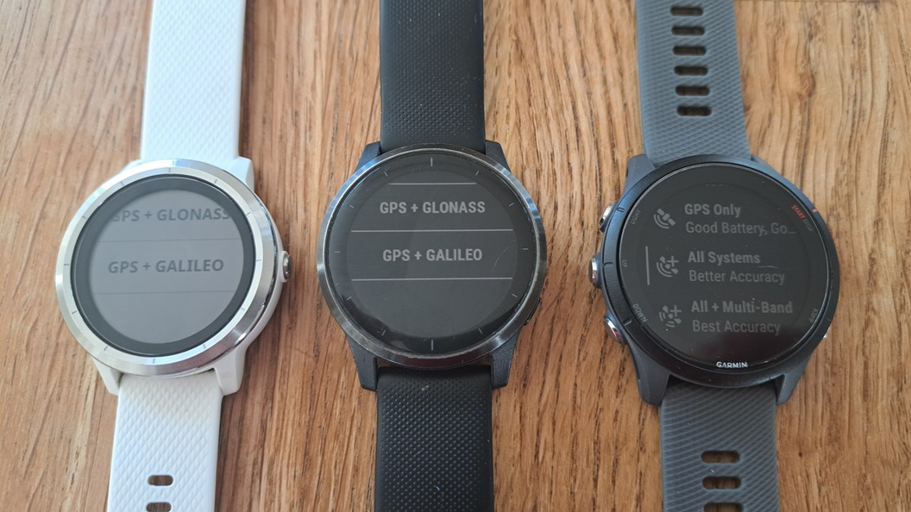
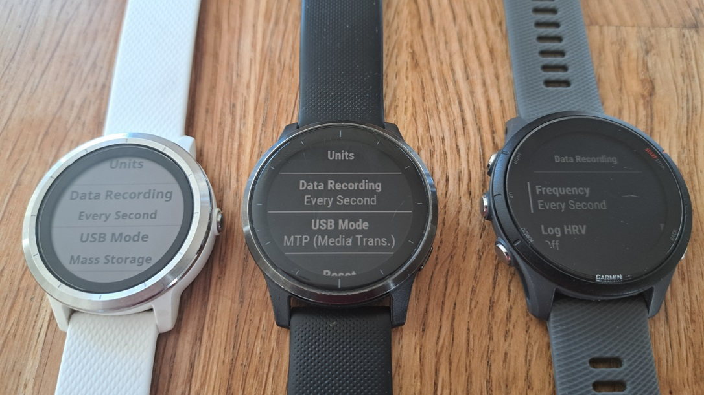

## Watch Setup

### Firmware

Dodgy

- GP3S Fenix 7
  - 3865 (GNSS) = 2.23
- Mark + zugm - Fenix 7 
  - 3866 = 2.27
- John FR-255
  - 3865 (GNSS) = 2.33

OK

- Mike FR-255
  - 3865 (GNSS) = 9.03 and 10
  - 3955 = 30.2
  - 3992 (FR-255) = 19.18

Be sure to re-check your settings after a firmware update.

### Watch Settings

Sats

Recording

- Satellite settings = all systems, GPS + Galileo, or GPS + GLONASS
- Data recording = every 1 second
- Phone Apps
  - Device Settings -> System -> Data recording = Every 1 Second (default = Smart)
- Watch
  - Vivoactive 3
    - Settings -> Activities & Apps -> [Activity] -> [Activity] settings -> GPS = GPS + Galileo (default = On)
    - Alternatively, can change it before you start the activity by swiping
  - Vivoactive 4
    - Settings -> Activities & Apps -> [Activity] -> [Activity] settings -> GPS = GPS + Galileo (default = On)
    - Alternatively, can change it before you start the activity by swiping
  - FR 255
    - Settings -> System -> Satellites = All Systems (default = GPS)
    - Settings -> Activities & Apps -> [Activity] -> [Activity] Settings -> Satellites = All Systems (default = GPS)
    - Alternatively, can change it before you start the activity by pressing the menu button

### Watch Apps

IMPORTANT - Application will select the activity profile and satellite settings

- Activity profile / app / data field
  - Activity type = other / windsurfing / kitesurfing
  - Satellite settings = all systems, GPS + Galileo, or GPS + GLONASS
- Apps / data fields
  - APPro Windsurf, GPSTC V4
  - Windsurf PRO and Any Sport PRO do not support all systems

APPro
https://forums.garmin.com/developer/connect-iq/f/showcase/2976/app-appro-windsurf

## Next Page

[Linked accounts](../accounts/README.md)

- GP3S, Hoolan, Waterspeed, Strava, Relive

