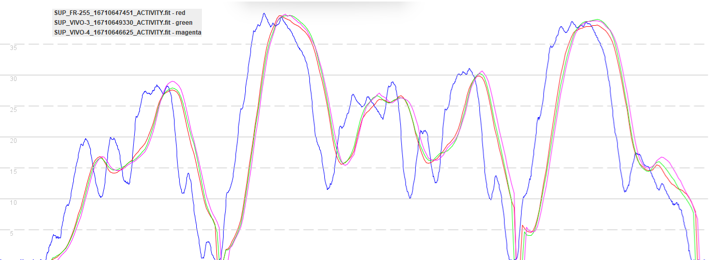

## Watch Usage

### Wearing the Watch

- How to wear - over wetsuit, back hand, not underhand

### Recording an Activity

Firmware and setttings

What is the latest GPS data?

Activity profiles / filters - SUP example

- DO NOT use SUP, swim, walk, run, etc.

Built in activities

- windsurfing - not available on Forerunner
- other

Recommended applications

- APPro Windsurf, GPSTC V4
- Mention
  - Windsurfing - older devices
  - Lots of people use JMG-APP Wind-Kite Pro (does wingfoil), 
  - Other mention Sail Racer Lite, Kite Tracker, Zef

IMPORTANT - Remember that the app will choose the satellite mode and activity profile.

### Additional Tips

- Find my phone + find my watch

## Next Page

[Data analysis](../analysis/README.md)

- Reviewing results, exporting activities, importing activities

