## 27 March 2022

### Summary

#### Overview

Lightwind windfoil session in south-easterly winds. Portland Harbour, UK.

Issues highlighted:

- This session was used for the detailed [analysis](../../devices/coros/apex-pro/speed-resolution.md) relating to Doppler "speed resolution" on the APEX Pro.
- There is an abundance of repeated speeds from the APEX Pro. The same speed every second to 3 decimal places!
- Effect of an underhand grip when wearing the GW-60 is clearly evident.
- Subtle differences between speeds on the COROS app and the GP3S website.

#### Devices

- COROS APEX Pro (1Hz) - firmware V2.54 - left wrist over wetsuit.
- Locosys GW-60 (5Hz) - firmware V1.3A0926B - right wrist over wetsuit.
- Locosys GW-52 (5Hz) and GT-31 (1Hz) - stored in Aquapac on right bicep.
  - GW-52 - firmware V1.2 G0529C - bottom of Aquapac, oriented downwards.
  - GW-31 - firmware V1.4 B0803T - top of Aquapac, oriented upwards with screen flipped.
- Motion Mini (10Hz) - firmware 3068 - left bicep.

### Observations

#### General

It was noted that timestamps from the Motion Mini were an hour different to the other devices when viewed in GPSResults. This session happened to be on the day that clocks were moved 1 hour for BST.

#### Underhand Grip

It is worth noting that the [SDOP](https://nujournal.net/estimating-accuracy-of-gps-doppler-speed-measurement-using-speed-dilution-of-precision-sdop-parameter/) figures on the GW-60 (lower chart, red line) were always highest when sailing on starboard tack. This was when the right hand was underhand grip and the GW-60 facing downwards. The SDOP and +/- estimates were always lowest when the GW-60 was facing upwards; overhand grip. This issue may well affect other GPS watches that are by their nature, wrist mounted.

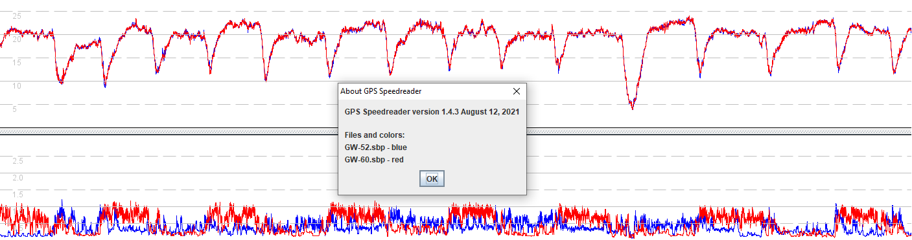

#### 500m

It is worth noting that runs 2 and 3 are ranked differently from the various devices:

- APEX Pro, GW-52 and Motion are the same
- GT-31 and GW-60 are the same

##### Run at 14:13 - starboard

APEX Pro on left wrist would have been facing upwards.

GT-31, GW-52, GW-60 and Motion Mini were pretty close in terms of speeds recorded.

The GT-31 (blue) and Motion Mini (magenta) clearly had the lowest error levels. GW-60 (right wrist) would have been facing downwards.

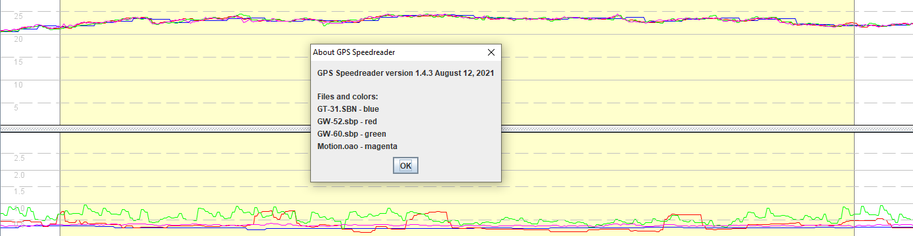

Note how the APEX Pro speeds (red) look very flat when compared to the GT-31 (blue).

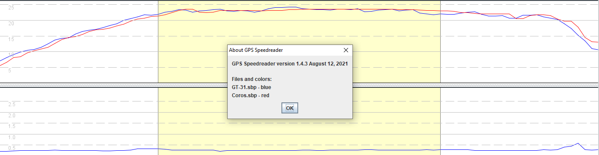

There are lots of repeated speeds in the APEX Pro data which is completely unrealistic.

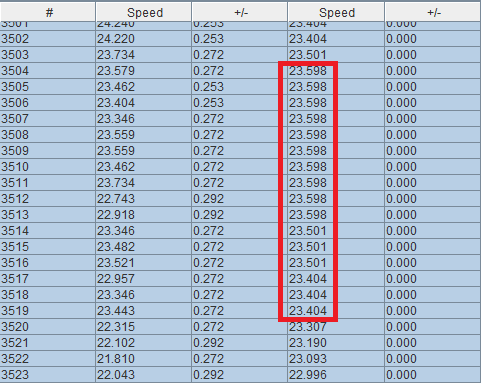

##### Run at 13:53 - starboard

APEX Pro on left wrist would have been facing upwards.

GT-31, GW-52, GW-60 and Motion Mini were pretty close in terms of speeds recorded.

The GW-60 (green) clearly showed the highest error levels. It would have been facing downwards; right wrist, underhand grip.

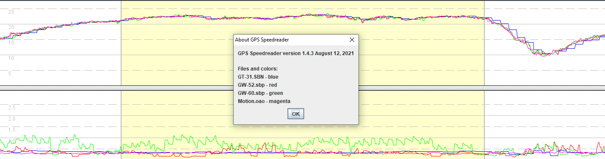

Note how the APEX Pro speeds (red) are very flat when compared to the GT-31 (blue).

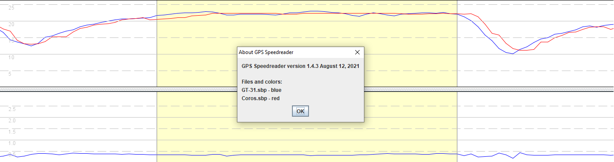

There are lots of repeated speeds in the APEX Pro data which as stated earlier is completely unrealistic.

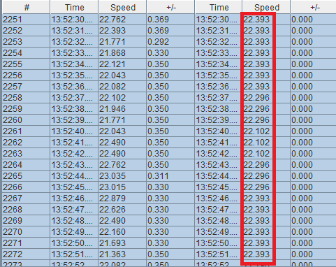

#### 10s

It is worth noting that runs 1 and 2 are ranked differently from the various devices:

- APEX Pro, GW-52 and Motion Mini are the same
- GT-31 and GW-60 are the same

##### Run at 14:13 - starboard

APEX Pro on left wrist would have been facing upwards.

GT-31, GW-52, GW-60 and Motion Mini were pretty close in terms of speeds recorded.

The GW-60 (green) and GW-52 (red) showed the highest error levels. The GW-60 (green) would have been facing downwards.

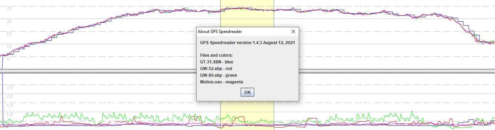

Note how the APEX Pro speeds (red) are very flat when compared to the GT-31 (blue).

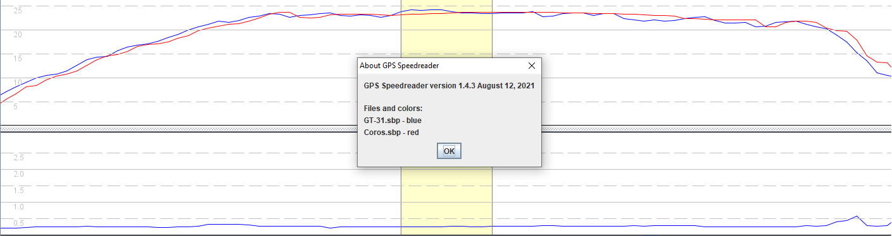

There are lots of repeated speeds in the APEX Pro data which is totally unrealistic; e.g. 23.598 knots for 11 seconds.

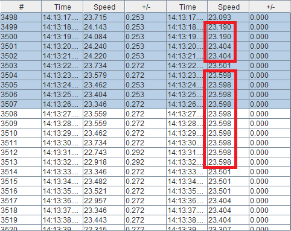

##### Run at 14:16 - port

APEX Pro on left wrist would have been facing downwards.

GT-31, GW-52, GW-60 and Motion Mini were pretty close in terms of speeds recorded.

All of the units are showing low error levels during the run. The GW-60 would have been facing upwards due to the run being on port.

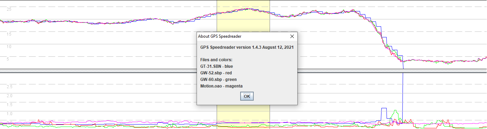

Note how the APEX Pro speeds are not consistent with the GT-31. After gybing, GT-31 lost its satellite fix for about 30 seconds.

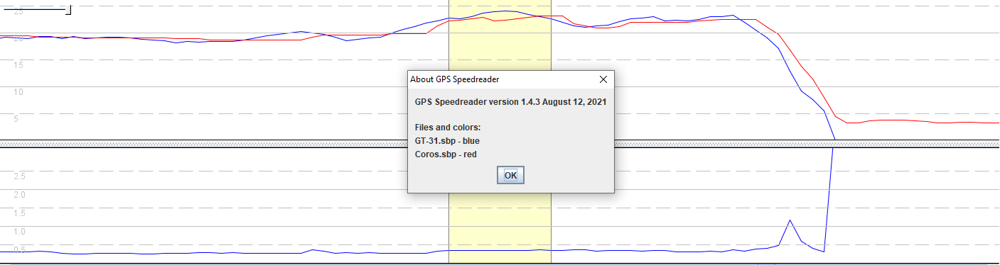

Repeated speeds are evident (yet again) in the APEX Pro data although not significantly affecting this particular run.

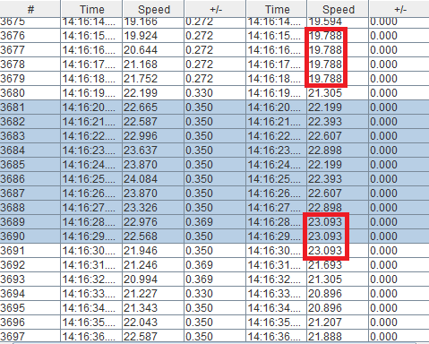

#### Posting to GP3S

As is often the case, APEX Pro results were slightly different on the phone app and GP3S website.

It's also worth noting that I did a lot more than 11 runs in one hour. I definitely wasn't doing runs of nearly 4km in length!

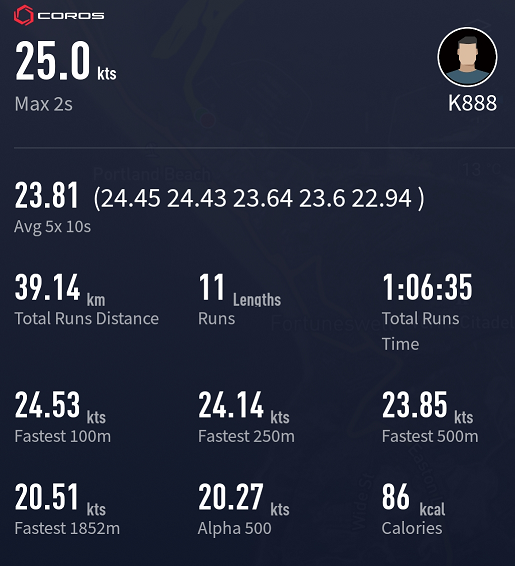

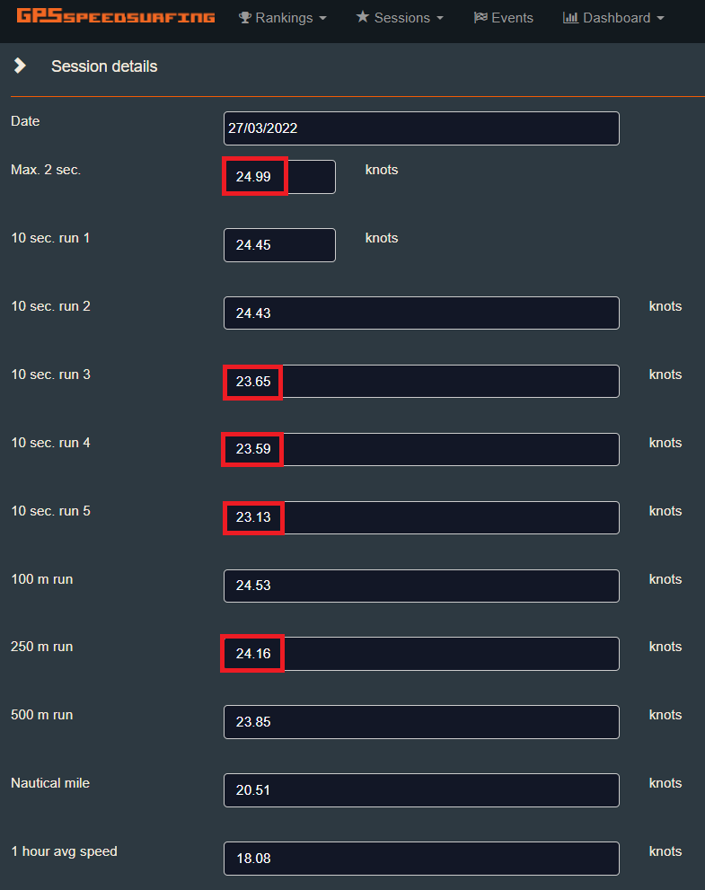

Differences after upload:

- 2s
- 10s results, especially run 5
- 250m
- alpha

This is pretty common when posting sessions to GP3S but isn't the end of the world, despite being slightly irritating.

The GP3S website shows exactly the same results that you can obtain on your own computer when analysing the FIT file.

### Wrap Up

Repeated speeds in the APEX Pro data are commonplace and to be logging exactly the same speed for as long as 11 seconds is clearly not accurate, especially when reported to 3 decimal places!

My [analysis](../../devices/coros/apex-pro/speed-resolution.md) into the "speed resolution" of the APEX Pro concluded that the speeds effectively have a precision equivalent to 1 decimal place. This goes some way to explaining why speeds are repeated but it still does not fully explain the phenomenon.

When looking across a number of runs it is clear that there are lots of flat regions in the APEX Pro data (red), showing no change of speed.

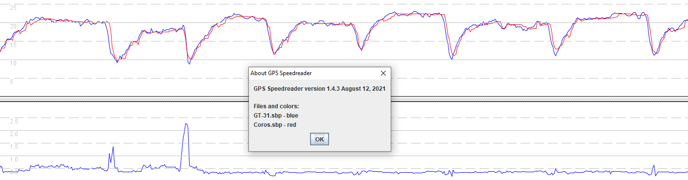

I suspect the APEX Pro (or the Sony GPS chip) is doing some over-zealous smoothing or perhaps the quest for low power usage is reducing the frequency of the Doppler speed updates within the device.

I can only speculate about the underlying cause but it's both surprising and disappointing to see such poor quality speed data, especially when produced by an expensive sports watch with a dedicated speed sailing mode.

It's also worth noting that the error levels of the GW-60 increase when using an underhand grip and the watch is facing downwards. This issue could easily affect any other wrist mounted GPS so it is worth bearing in mind.

Most people already know about differences between speeds on the COROS app and the GP3S website. It's a mild irritation but not hugely important that the watch calculates slightly different results during the session.

I'm most concerned about the quality of the speed data that it produces; certainly nowhere near as good as the old trusty GT-31.
