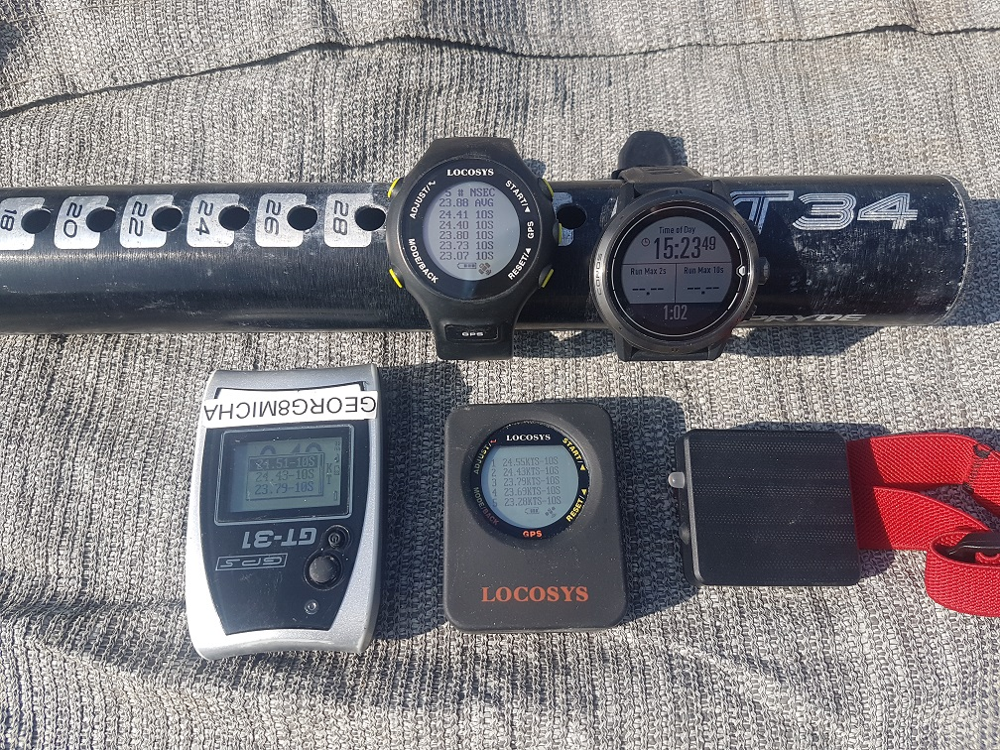

## 4 April 2022

### Summary

#### Overview

Windfoil session in westerly winds. Brogborough Lake, UK.

My first time breaking 30 knots on a hydrofoil. yay!

Importantly, I confirmed the COROS [data issues](../../devices/coros/data-issues.md) are still present in the V2.66.0 firmware.

I also did some "crash testing" during the session. Useful for SDOP and sAcc analysis!

#### Devices

- COROS APEX Pro (1Hz) - firmware V2.66.0 - left wrist over wetsuit.
- Locosys GW-60 (5Hz) - firmware V1.3A0926B - right wrist over wetsuit.
- Locosys GW-52 (5Hz) and GT-31 (1Hz) - stored in Aquapac on right bicep.
  - GW-52 - firmware V1.2 G0529C - bottom of Aquapac, oriented downwards.
  - GW-31 - firmware V1.4 B0803T - top of Aquapac, oriented upwards with screen flipped.
- Motion Mini (10Hz) - firmware 3068 - left bicep.

### Track Data

You can find all of the tracks on [GitHub](https://github.com/Logiqx/gps-guides) under sessions/20220404/tracks.

