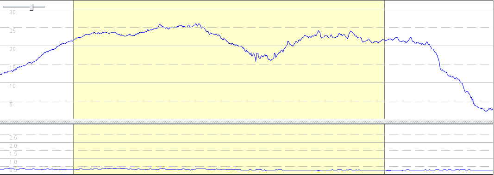

## 4 April 2022

### Summary

#### Overview

Windfoil session in westerly winds. Brogborough Lake, UK.

- My first time breaking 30 knots on a hydrofoil. yay!
- Importantly, I confirmed the COROS [data issues](../../devices/coros/data-issues.md) are still present in the V2.66.0 firmware.
- 500m results add useful insight into appropriate mAcc filter values.
- I also did some "crash testing" during the session. Useful for SDOP and sAcc analysis!

#### Devices

- COROS APEX Pro (1 Hz) - firmware V2.66.0 - left wrist over wetsuit.
- Locosys GW-60 (5 Hz) - firmware V1.3A0926B - right wrist over wetsuit.
- Locosys GW-52 (5 Hz) and GT-31 (1 Hz) - stored in Aquapac on right bicep.
  - GW-52 - firmware V1.2 G0529C - bottom of Aquapac, oriented downwards.
  - GW-31 - firmware V1.4 B0803T - top of Aquapac, oriented upwards with screen flipped.
- Motion Mini (10 Hz) - firmware 3068 - left bicep.

### mAcc Filter

The alpha 500 results provide useful insights into appropriate mAcc filter values on a 10Hz device.

- GPSResults reports the best alpha 500 (slightly over 22 knots) at 12:56 on all devices.
- All devices with the exception of the Motion Mini also have this alpha as the fastest 500m.

GPSResults does not regard the Motion Mini alpha as a valid 500m because mAcc is 11.2 and the filter only allows mAcc of 10.0. This results in an anomaly that the alpha is faster than the 500m; 22.132 @ 12:56:03 vs 21.820 @ 14:10:13 

Looking at the data from the Motion Mini it is is clear that the sAcc is very low and consistent through the alpha and the high mAcc for what was probably 1/10th second was most likely the rig flip.

The screenshot is from GPS Speedreader, showing consistent sAcc at the bottom.

Other alpha results in this track contain an mAcc of 13.7, 13.8 and 14.1. In all instances the sAcc is extremely low and these runs should therefore be considered valid over 500m.

Conclusion: For 10Hz data from the Motion Mini it seems to make sense to have an mAcc filter of 16.0 like [GPS Speedreader](https://ecwindfest.org/GPS/GPSSpeedreader.html).

### Track Data

You can find all of the tracks on [GitHub](https://github.com/Logiqx/gps-guides) under sessions/20220404/tracks.

