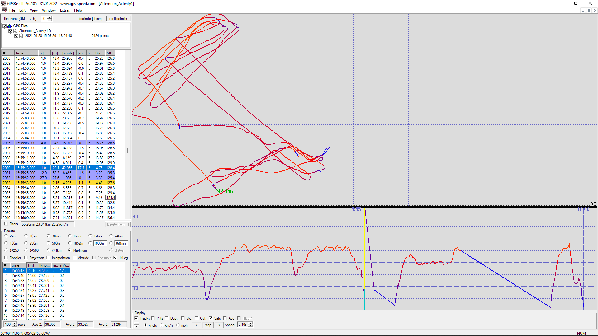
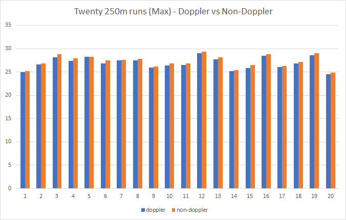
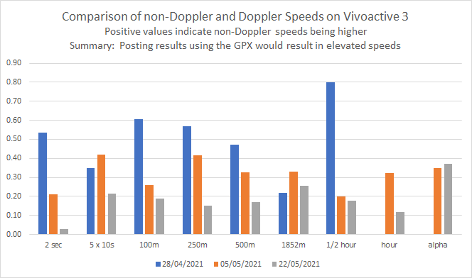

## Max's Tracks

### GPS Device

Garmin Vivoactive 3 - firmware 7.70.

### 20210428

#### Big Spike - 43 Knots

The positional speeds contain a spike of 42.96 knots, likely caused by a crash or falling in. Fortunately it was automatically filtered because of the rate of deceleration.

Spikes that are more subtle may not be high enough to be filtered out but can still be large enough to elevate the reported result, sometimes by several knots.

#### Non-Doppler vs Doppler

Comparison of the non-Doppler figures posted to GP3S against the non-Doppler and Doppler actuals from the FIT. The 250m posted was at least 0.57 knots too high.

It is impossible to determine whether the Doppler speeds are accurate or too high.

|          | GP3S  | Non-doppler | Doppler | Diff |
| -------- | ----- | ----------- | ------- | ---- |
| 2 sec    | 29.11 | 29.13       | 28.59   | 0.54 |
| 5 x 10s  | 27.28 | 27.28       | 26.93   | 0.35 |
| 100m     | 28.82 | 28.83       | 28.22   | 0.61 |
| 250m     | 28.46 | 28.46       | 27.89   | 0.57 |
| 500m     | 27.53 | 27.53       | 27.06   | 0.47 |
| 1852m    | 24.89 | 24.89       | 24.67   | 0.22 |
| 1/2 hour | 12.45 | 12.38       | 11.58   | 0.80 |
| hour     | 0.00  | 0.00        | 0.00    | 0.00 |
| alpha    | 17.18 | 0.00        | 0.00    | 0.00 |

### 20210505

#### Non-Doppler vs Doppler

Comparison of the non-Doppler figures posted to GP3S against the non-Doppler and Doppler actuals from the FIT. The 250m posted was at least 0.41 knots too high.

It is impossible to determine whether the Doppler speeds are accurate or too high.

|          | GP3S  | Non-doppler | Doppler | Diff |
| -------- | ----- | ----------- | ------- | ---- |
| 2 sec    | 29.86 | 29.86       | 29.65   | 0.21 |
| 5 x 10s  | 29.19 | 29.19       | 28.77   | 0.42 |
| 100m     | 29.54 | 29.54       | 29.28   | 0.26 |
| 250m     | 29.39 | 29.39       | 28.98   | 0.41 |
| 500m     | 28.32 | 28.32       | 27.99   | 0.33 |
| 1852m    | 26.08 | 26.08       | 25.75   | 0.33 |
| 1/2 hour | 17.24 | 17.24       | 17.04   | 0.20 |
| hour     | 15.94 | 15.94       | 15.62   | 0.32 |
| alpha    | 20.12 | 20.12       | 19.77   | 0.35 |

#### Doppler vs Positional

The top 20 runs over 250m show that non-Doppler is faster than Doppler in this session:

- Average of 0.36 knots faster
- Maximum of 0.76 knots faster

#### Speed Resolution

Confirmed speed resolution to be 1 cm/s.

### 20210505

#### Non-Doppler vs Doppler

Comparison of the non-Doppler figures posted to GP3S against the non-Doppler and Doppler actuals from the FIT. The 250m posted was at least 0.15 knots too high.

It is impossible to determine whether the Doppler speeds are accurate or too high.

|          | GP3S  | Non-doppler | Doppler | Diff |
| -------- | ----- | ----------- | ------- | ---- |
| 2 sec    | 30.27 | 30.23       | 30.20   | 0.03 |
| 5 x 10s  | 27.97 | 27.97       | 27.76   | 0.21 |
| 100m     | 30.15 | 30.15       | 29.96   | 0.19 |
| 250m     | 29.86 | 29.86       | 29.71   | 0.15 |
| 500m     | 28.89 | 28.89       | 28.72   | 0.17 |
| 1852m    | 23.81 | 23.81       | 23.56   | 0.25 |
| 1/2 hour | 16.48 | 16.48       | 16.30   | 0.18 |
| hour     | 11.93 | 9.44        | 9.32    | 0.12 |
| alpha    | 18.59 | 15.74       | 15.37   | 0.37 |

### Summary

#### Non-Doppler vs Doppler

This is a graphical view of all the sessions posted vs the FIT results.

In all categories the results posted to GP3S are higher than the Doppler speeds.

It is impossible to determine whether the Doppler speeds are accurate or too high.

### Track Data

You can find all of the tracks on [GitHub](https://github.com/Logiqx/gps-guides) under sessions/contacts/beam/tracks.

