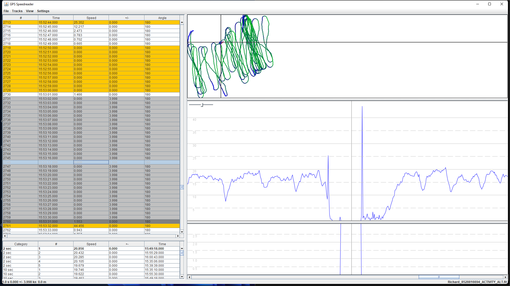

## Richard's Tracks

### Garmin Fenix 3

Richard's track.

This watch uses the MediaTek MT3333.

### Spikes

Firstly, this was entirely a consequence of running the data through GPSBabel, and serves as a warning that it can do unexpected things to your data!

The end result was an apparent 25 knot spike followed by a big 44 knot spike, following a crash. These spikes were NOT in the original FIT data.

The standard "max acceleration" filter excluded these from the GPSBabel results since "Sats", "HDOP" or "SDOP" are not present.

Important note: This spike is not present in the Doppler speeds of the original FIT. It was only introduced by GPSBabel and is from positional speeds.

### Track Data

You can find all of the tracks on [GitHub](https://github.com/Logiqx/gps-guides) under sessions/contacts/bear/tracks.

