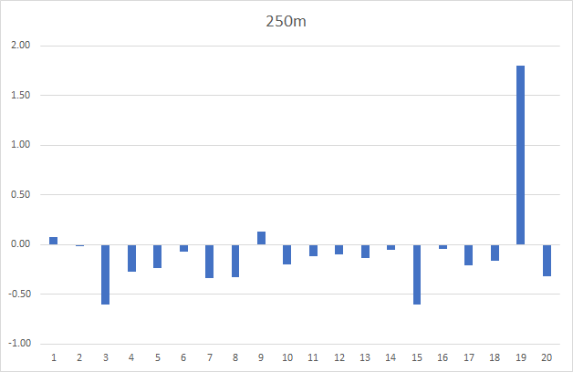
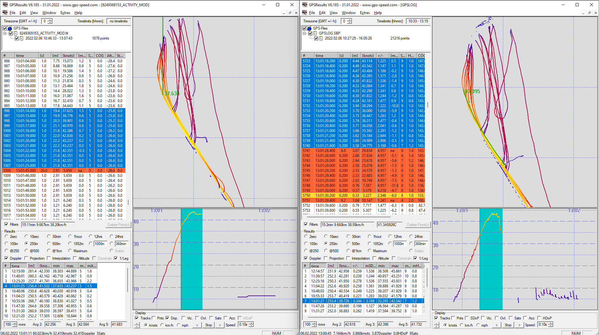
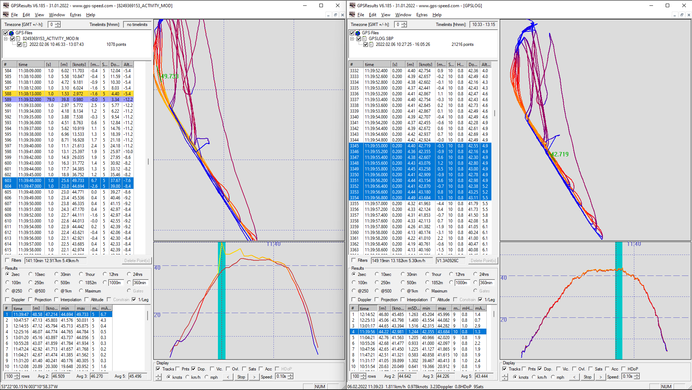
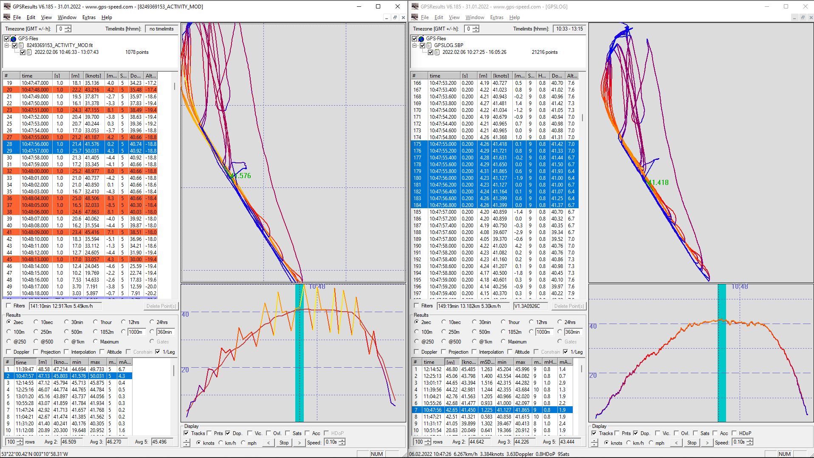
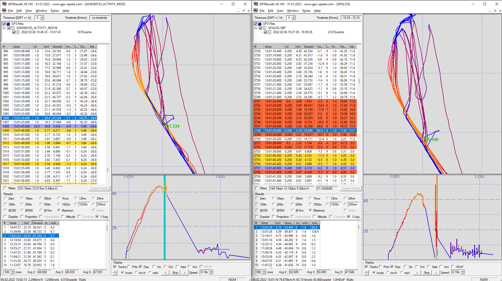
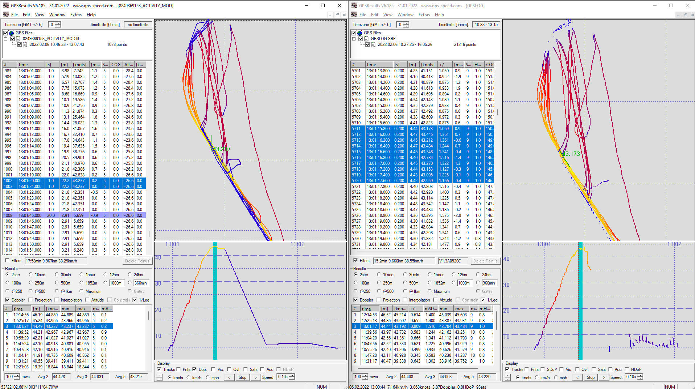

## Stuey's Tracks

### Device Details

- Garmin Fenix 6X - Firmware 20.30.

- Locosys GW-60 - Firmware V1.3A0926C.

### 20220206

West Kirby Session with GW-60 and Fenix 6X. Screenshots show Fenix 6X on the left, GW-60 on the right.

#### General Comparison

An analysis was undertaken for all runs during the session to see how the Fenix 6X speeds compared to the GW-60.

As an example, the following chart shows the differences for 250m. Most of the 250m results were similar, but generally slightly slower on the Fenix 6X.

Looking at the 250m run where the Fenix 6X reported 1.8 knots higher than the GW-60 it is clearly due to a crash.

The GW-60 lost its satellites at 13:01:21 but the Fenix 6X continued reporting exactly 42.351 knots for a further 4 seconds. The crash may have begun at at 42 knots but GW-60 lost its satellites two seconds later, reporting just under 35 knots.

This gives some insight into the workings of the Kalman filter in the Sony chip which would probably have lost its satellites at the same time as the GW-60 but continued to report an exact speed of 42.351 knots for a further 4 seconds. It never reported the speeds down to 34 knots like the GW-60.

The full comparison of speeds during the session can be found in an Excel [spreadsheet](analysis/20220206.xlsx).

#### Spikes

The session contains a few spikes in non-Doppler speeds, derived solely from positional data. They serve as a good illustration as to why the Doppler-derived speed data should always be used for results. It's important to remember that Doppler-derived speeds are not included in GPX exports from the Garmin devices so the FIT format should always be exported from Garmin Connect.

Example 1 - 49.73 knot spike (yellow) on the Fenix 6X during a normal run inflates the 2s result to 47.21 knots.

Example 2 - 50.03 knot spike on the Fenix 6X during a normal run inflates the 2s result to 45.80 knots. The "Sonic the Hedgehog" speed graph for the Fenix 6X is only evident in the non-Doppler speeds, derived from positional data. Doppler speeds (red) from the Fenix 6X look fine during that run.

Example 3 - 47.33 knot spike on the Fenix 6X is the result of a crash. It is also worth noting the presence of 55.94 and 49.43 knot spikes from non-Doppler speeds of the GW-60 at the same time.

The Doppler-derived speeds at the time of the crash do not contain spikes for either the Fenix 6X or GW-60. This again highlights the importance of using Doppler-derived speeds and not the speeds derived from positional data. Always export using from Garmin Connect using the FIT format and avoid GPX.

It should however be noted that the Fenix 6X continued to report a speed of exactly 42.351 knots for a further 4 seconds after the crash.

#### Repeated Speeds

The "repeats" issue that I spotted on the COROS APEX Pro is also evident on the Garmin Fenix 6X.

Note: Although the image on the left includes a crash the run on the right was was perfectly normal yet reported 40.663 knots for 6 seconds.

This suggests to me that it is something happening in the Sony GPS chip, probably an artefact of the Kalman filter.

I wonder if this behavior be changed from within the watch firmware; e.g. specifying a different navigation mode or switching smoothing off?

#### Speed Resolution

This session confirmed speed resolution of the Fenix 6X to be 10 mm/s like Paul's Fenix 6 with 19.20 firmware.

This is better than the COROS APEX Pro and VERTIX which have a resolution of 50 mm/s.

### 20220421

Bike ride, yet to be analyzed.

### Track Data

You can find all of the tracks on [GitHub](https://github.com/Logiqx/gps-guides) under sessions/contacts/gwys/tracks.

