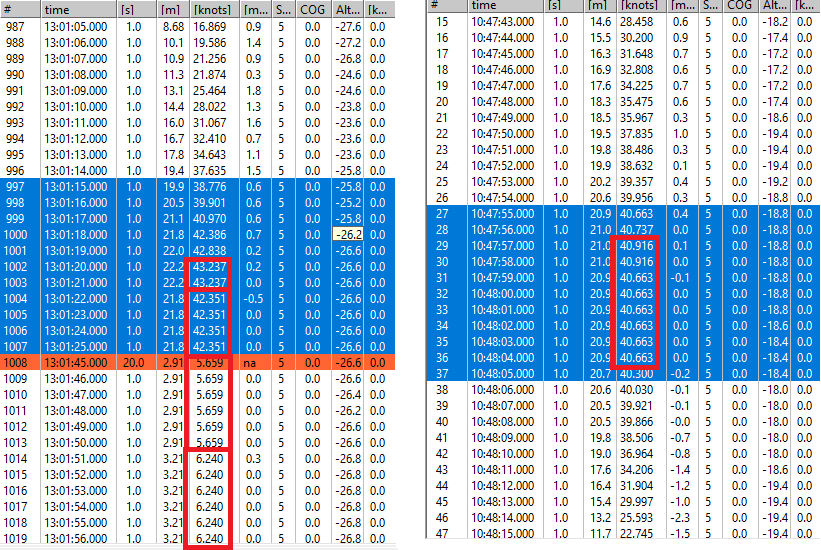

## Stuey's Tracks

### Device Details

Garmin Fenix 6X - Firmware 20.30.

n.b. This watch uses the same Sony GPS as the COROS APEX Pro and VERTIX, etc.

### 20220206

West Kirby Session with GW-60 and Fenix 6X.

#### Repeated Speeds

The "repeats" issue that I spotted on the COROS APEX Pro is also evident on the Fenix 6.

Note: Although the first run includes a crash the second run was perfectly normal.

This suggests to me that it is something happening in the Sony chip, probably the Kalman filter.

Can this behavior be changed from within the watch firmware; specifying a different navigation mode or switching smoothing off?

#### Speed Resolution

Confirmed speed resolution to be 10 mm/s like Paul's Fenix 6 with 19.20 firmware.

This is better than the COROS APEX Pro and VERTIX which have a resolution of 50 mm/s.

### 20220421

Bike Ride.

### Track Data

You can find all of the tracks on [GitHub](https://github.com/Logiqx/gps-guides) under sessions/contacts/gwys/tracks.

