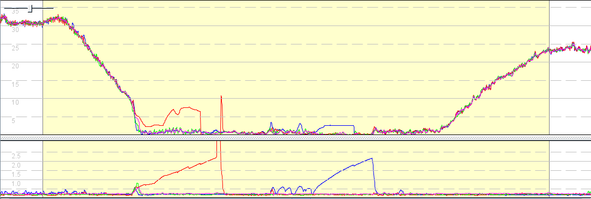
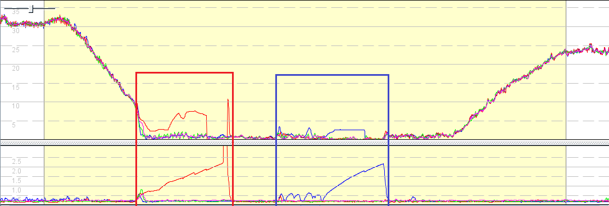

## ESP-GPS Observations

After taking a look at the EPS-GPS tracks from Jan, I made some posts on [Seabreeze.com](https://www.seabreeze.com.au/forums/Windsurfing/Gps/NEW-Website-for-GPS-Device-Details?page=1#10).

### Analysis

I've had a look over breakfast and my initial observations are consistent with conversations that I've seen elsewhere in this forum.

The data quality looks very good overall. and as has previously been discussed, micro accelerations are picked up simultaneously by units mounted in the same way (e.g. two units on the boom or two units on the head). Units on the head tend to show these changes out of phase with the boom as previously discussed on this forum.

My thinking is that if the units are sensitive enough to pick up all of these micro changes, they will cancel each other out over the period being measured; 10s, 500m , etc. These micro changes are more extreme on the boom due to the effect of chop but this is generally evident in elevated sAcc values. As mentioned elsewhere, rig flips can be seen in the boom data but seem to have little overall effect.

Overall, boom and head mounted results are very comparable. Over the most "important" categories (10s, 500, alpha) it looks like the worst differences are in the order of 0.02 to 0.05 knots. The 2s category sometimes differs by more (up to 0.1 knot) but well, it's 2s and imo that is plenty good enough. Interestingly, boom mounting generally seems to report slightly slower speeds over 2s in the test files.

I'll do a separate response detailing what I saw in the sAcc data.

### sAcc

The sAcc test data was particularly interesting in the Herkingen data. During speed runs it is rock solid and shows we can have extremely high confidence in the speeds being calculated under normal conditions, during runs, etc.

The Herkingen "alphas" (stop, turn, sail back) are an interesting illustration of what happens at the end of a typical speed run. The head units (magenta and green) retain a good signal whilst the boom units (red and blue) go a bit awry. I'm assuming the sail is either in the water or held low for a little while, subsequently flipped low to the water and then beach / water started.

It's clear from the sAcc data when the red and blue units should be ignored but personally, I think it can be done more intelligently than a simple sAcc > 1 filter applied to individual readings. It is clear when the accuracy data changes and I feel that a range can be determined, starting when it begins to diverge from "normal" and ending when it returns to "normal". Any sustained periods of abnormality could then be filtered out, including when the sAcc begins to rise and immediately prior to the return to normality, regardless of sAcc < 1.

This is one for the software devs to discuss but if I were to implement it myself, I'd look for sAcc "spikes" (e.g. above a threshold such as 1.0 or perhaps even 0.8) then for those spikes, determine where sAcc started to diverge from normal and when it subsequently returned to normal. Filter out that entire period and you are left with "trustworthy" data for results.

Just my two cents. :)  

### Highlights

Just for the sake of clarity, here's an illustration of the contiguous ranges that I think should be ignored (filtered) during the analysis of red and blue.

From an algorithmic point of view; find the sAcc peaks and then scan forwards + backwards, looking for the first continuous 2s worth of "good" sAcc values to decide where the bad data starts and ends.

So essentially, having a definition that a period can only be regarded as "good" if it lasts for at least 2 seconds and the "lumpy" sAcc data from the blue unit is therefore considered to be one contiguous "bad" period.  

