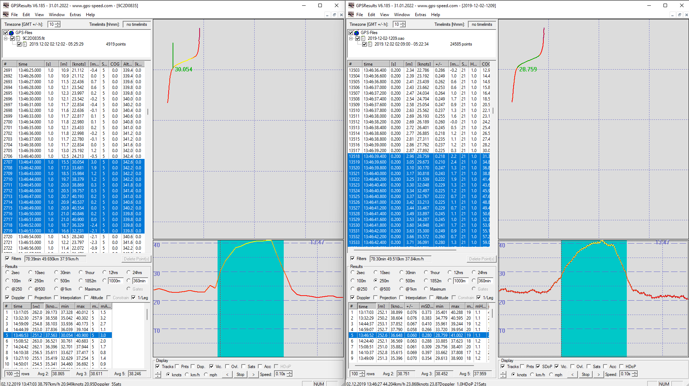
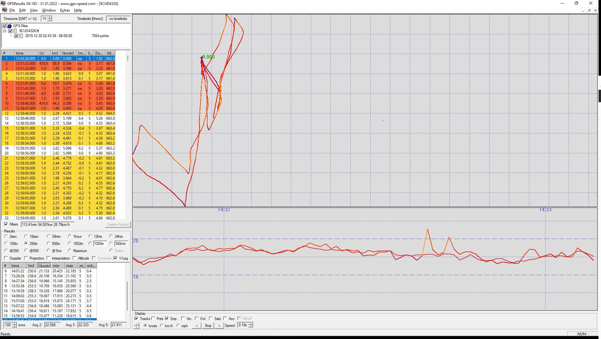

## Greg's Tracks

### Devices

- Garmin Fenix 3 - Firmware 8.20
- Motion Mini

### 20181216 - Fenix 3 vs Motion Mini

No obvious 1 second spikes in Doppler or non-Doppler speeds from the Fenix 3.

Lots of bad data / missing values in the Motion track.

Comparing available 2s results:

- 05:29:21 = 0.01 higher on Fenix 3
- 05:12:02 = 0.02 higher on Fenix 3

Comparing available 10s results:

- 05:29:26 = 0.10 higher on Fenix 3
- 05:12:04 = **0.47 higher on Fenix 3**, seems to be an sAcc issue on Motion
- 05:00:22 = **0.37 higher on Fenix 3**, Fenix not picking up slow deceleration

Comparing available 500m results:

- 05:29:25 = 0.01 higher on Fenix 3
- 04:30:19 = 0.08 higher on Fenix 3

### 20191202 - Fenix 3 vs Motion Mini

Spikes:

- Obvious 70 knot spike @ 11:08:54 (non-Doppler) from the Fenix 3, during a regular run. File 002.FIT
- Quite a big 2s over-reading (Doppler) on Fenix 3 @ 05:08:45. Happened during a big slingshot.

Comparing 2s results:

- 03:46:51 = **0.50 higher on Fenix 3**
- 03:32:28 = 0.15 lower on Fenix 3
- 05:08:45 = **1.98 higher on Fenix 3** and **single reading is 2.3 knots too high**
- 04:59:05 = **0.36 higher on Fenix 3**
- 03:17:04 = 0.04 lower on Fenix 3

Comparing 10s results:

- 03:17:48 = 0.15 higher on Fenix 3
- 03:32:29 = 0.02 higher on Fenix 3
- 03:46:52 = **0.82 higher on Fenix 3**
- 04:59:06 = 0.22 higher on Fenix 3
- 05:08:50 = **0.92 higher on Fenix 3**

Comparing 250m results:

- 03:17:05 = 0.27 higher on Fenix 3
- 03:32:30 = 0.04 lower on Fenix 3
- 04:59:09 = **0.31 higher on Fenix 3**
- 04:44:39 = 0.01 lower on  Fenix 3
- 03:46:52 = **0.92 higher on Fenix 3** - big slingshot - see image below
- 05:08:52 = **0.64 higher on the Fenix 3** - another big slingshot

Comparing 500m results:

- 04:44:45 = 0.02 lower on Fenix 3
- 04:24:44 = 0.02 lower on Fenix 3
- 04:10:40 = 0.12 higher on Fenix 3
- 02:19:50 = 0.14 lower on Fenix 3
- 03:17:17 = 0.10 higher on Fenix 3

### 20191230 - Fenix 3 vs Motion Mini

Spikes:

- Obvious 62 knot spike @ 14:46:44 (non-Doppler) from the Fenix 3, whilst stationary.

- Another 31.4 knot spike @ 15:32:55 (non-Doppler) from the Fenix 3, during a 20 knot run.

Comparing 2s results:

- 05:28:49 = **0.99 higher on Fenix 3**
- 05:52:00 = **1.00 higher on Fenix 3**
- 03:21:35 = 0.05 lower on Fenix 3
- 03:06:35 = 0.05 higher on Fenix 3
- 04:01:16 = 0.01 higher on Fenix 3

Comparing 10s results:

- 05:28:49 = **0.38 higher on Fenix 3**
- 05:51:43 = 0.19 lower on Fenix 3
- 03:21:39 = 0.02 lower on Fenix 3
- 03:06:39 = 0.03 lower on Fenix 3
- 04:01:17 = same

Comparing 250m results:

- 05:28:49 = 0.03 lower on Fenix 3
- 05:52:00 = 0.13 lower on Fenix 3
- 03:31:41 = 0.03 lower on Fenix 3
- 03:05:54 = 0.04 higher on Fenix 3
- 04:01:20 = 0.02 higher on Fenix 3

Comparing 500m results:

- 05:51:41 = 0.10 lower on Fenix 3
- 03:06:17 = 0.02 lower on Fenix 3
- 04:01:21 = 0.03 higher on Fenix 3
- 05:28:55 = 0.07 lower on Fenix 3
- 03:21:51 = 0.06 lower on Fenix 3

Note: This tracks suggest the speed really is independent of position, likely Doppler-derived.

Look at the data between 14:32 and 14:33. The speed data is **not** just smoothed track points.

### 20200309 - Fenix 3 vs Motion Mini

No obvious 1 second spikes in Doppler or non-Doppler speeds from the Fenix 3.

Comparing 2s results:

- 05:32:44 = 0.13 lower on Fenix 3
- 05:51:59 = 0.13 higher on Fenix 3
- 06:16:04 = 0.18 lower on Fenix 3
- 05:18:01 = **possibly over-reading by ~0.4 knots**
- 05:43:11 = 0.16 lower on Fenix 3

Comparing 10s results:

- 05:32:44 = 0.12 higher on Fenix 3
- 05:52:04 = 0.10 higher on Fenix 3
- 05:18:51 = 0.45 higher on Fenix 3 but times are offset
- 06:16:07 = 0.09 lower on Fenix 3
- 05:43:12 = 0.02 lower on Fenix 3

Comparing 250m results:

- 05:31:52 = 0.05 lower on Fenix 3
- 05:18:58 = 0.21 higher on Fenix 3
- 05:52:14 = 0.16 higher on Fenix 3
- 06:16:17 = 0.03 lower on Fenix 3
- 05:41:57 = 0.06 higher on Fenix 3

Comparing 500m results:

- 05:33:49 = 0.16 lower on Fenix 3
- 06:12:37 = 0.11 lower on Fenix 3
- 05:18:13 = 0.07 higher on Fenix 3
- 05:52:14 = 0.08 higher on Fenix 3
- 05:42:10 = cannot compare

### Conclusions

Speeds:

- Massive spikes in non-Doppler speeds can appear during normal runs - 70 knots observed.
- 2s can often read too high on the Fenix 3, sometimes by 1 or 2 knots.
- 10s can also read too high on the Fenix 3, sometimes up to 1 knot.
- 250m can also read too high, particularly during massive slingshots, sometimes up to 1 knot.
- 500m is typically fairly decent on the Fenix 3, usually +/- 0.10 knots.

General:

- Fenix 3 can over-estimate when accelerating or decelerating rapidly.
- Fenix 3 can produce significant spikes when stationary / wet but they are obvious when reviewed.
- Overall, Fenix 3 is pretty decent during normal sailing (especially 500m) but slingshots can lead to over-reading.

Note: Speed from the Fenix 7 does indeed look like it is Doppler-derived and has a Kalman filter.

### Track Data

You can find all of the tracks on [GitHub](https://github.com/Logiqx/gps-guides) under sessions/contacts/kisg/tracks.

