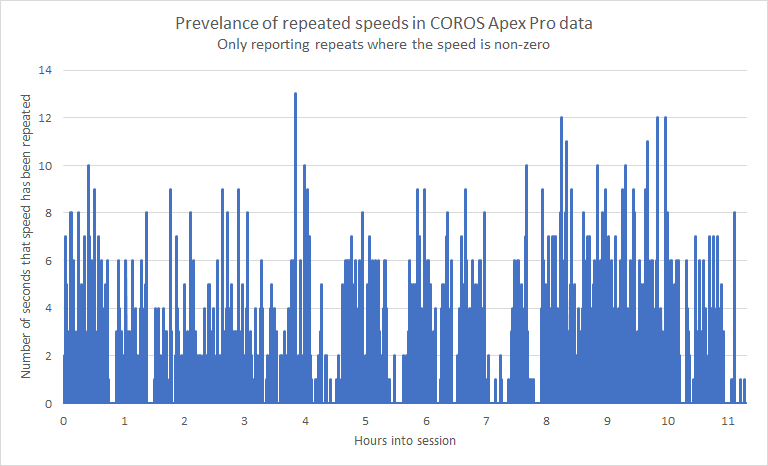
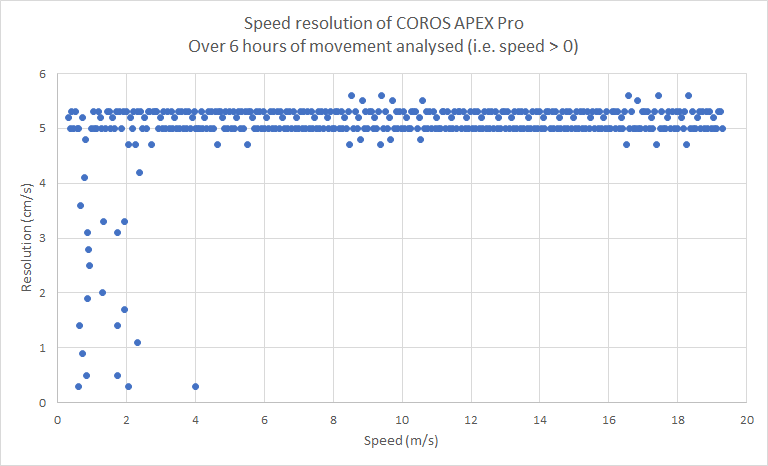

## Mark's Tracks

### COROS VERTIX

Mark provided 3 VERTIX tracks from 2021 to compare with the observations relating to my APEX Pro.

Repeated speeds were abundant in Mark's VERTIX sessions, just like my APEX Pro sessions. The chart below illustrates that repeats for 5 or 6 seconds are not uncommon and can be go on for as long as 13 seconds.

I was also able to confirm the speed resolution of 5 cm/s by combining the data from all 3 sessions. Speeds below 8 knots (4 m/s) can sometimes have a higher resolution.

### Garmin Fenix 5

Mark also provided me with a track from the Garmin Fenix 5.

I was able to confirm the resolution of 1 cm/s which is the same as Locosys devices; e.g. GT-31, GW-52, GW-60:

In addition to confirming the resolution of Doppler speeds, it also proved to be a good example of why non-Doppler speeds should not be trusted.

The screenshot from GPSResults 6.185 clearly shows a 40 knot spike (yellow) in the speed calculated from positional data.

The true speed (red) was about 33 knots which was consistent with the GW-60 track that was also provided.

#### British Speed Challenge

It is worth noting that  250m runs can be much faster when using non-Doppler results.

For example, the 250m run at 14:19:03 is 34.435 knots non-Doppler, 33.470 knots Doppler.

For this reason, British Speed Challenge <u>must</u> always ensure Doppler speeds are used.

### Track Data

You can find all of the tracks on [GitHub](https://github.com/Logiqx/gps-guides) under sessions/mark/tracks.

