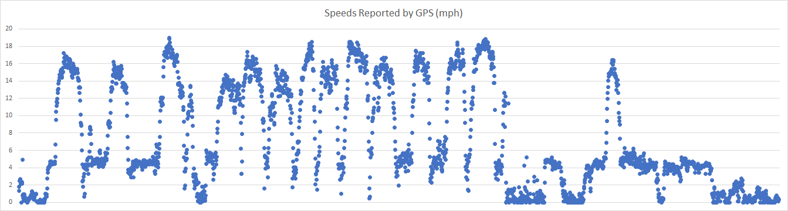
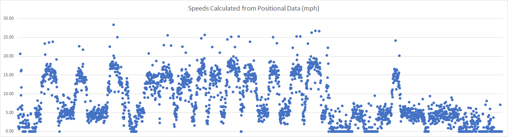
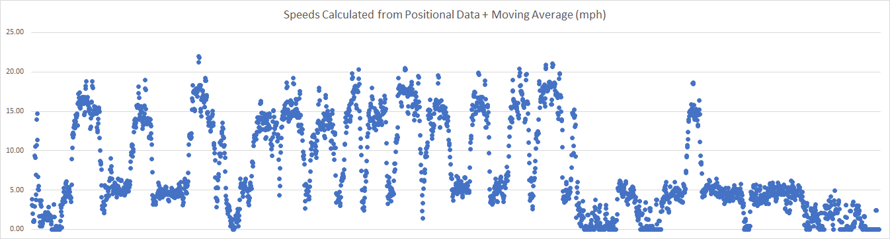

## Rick's Tracks

### Devices

- Timex Ironman

### Conclusions

- Strava is clearly using positional data to calculate speeds.
  - This is probably for consistency because many devices only record positional data (latitude and longitude) and do not record their "estimated" speeds.
  - Speeds calculated from positional data are always problematic. They are always higher than both the true speed and the "estimated" speed.
  - Speeds calculated from positional data are also going to be prone to extreme "spikes" which may (or may not) be hidden from the user by filtering.
- It is not clear whether Strava is smoothing the "positional speeds", filtering the results or doing both.
  - Smoothing the speeds calculated from positional data results in a max speed of almost exactly 22 knots.
  - Filtering could be something as crude as the "top 1%" of speeds or based on some bespoke rules / logic.
- Regardless of what Strava is doing on top of using positional data for speeds (smoothing and / or filtering) it is clear that the reported max speeds are very unreliable.
- The GPS itself has the best chance of estimating the true speed, deriving it from the observable Doppler shift and with the aid of a Kalman filter.
- When a GPS records the estimated speed in the FIT file it is always much more reliable than speeds subsequently calculated from the positional data.

### Track Data

The track was provided as a FIT file which is just what is needed for diagnostics.

The FIT file contains both the positional data (i.e. latitude, longitude and altitude) and the estimated speed.

|                            | Distance (miles) | Max Speed (mph) |
| -------------------------- | ---------------- | --------------- |
| Timex Connect and on-watch | 11.33            | 18.97           |
| Strava                     | 11.32            | 22.0            |

Note: The FIT file also contains distance data during the session and this shows a total of 11.33 miles.

#### Estimated Speeds

In most GPS devices the "estimated" speed will be derived from the observable Doppler shift in the carrier signal from each individual satellite. The effects of noise are reduced by a Kalman filter (or to be more precise and extended Kalman filter), resulting in the best possible estimate of the true speed.

The max speed reported by the Ironman and Timex Connect was 18.97 mph and this was also the max speed in the FIT file. All of the speeds "estimated" by the Ironman and recorded in the FIT file are shown in the chart below.

#### Positional Speeds

Calculating speeds from changes in longitude and latitude shows the same general trend but many errors are evident. This is because positional data is inherently "noisy" and is therefore far less accurate than the speeds estimated by the GPS itself.

The maximum speed calculated from Ironman positional data is approximately 28.37 mph but it is clearly not realistic. The highest speeds calculated are clearly just "noise" and are due to the inaccuracies of positional data.

#### Smoothed Positional Speeds

Calculating speeds from changes in longitude and latitude, then smoothing the results with a moving average produces cleaner speeds which are slightly more realistic.

The max speed after such smoothing is 21.99 knots which is very close to the 22.0 knots that Strava reported. This could just be a coincidence but it definitely does not reflect the true max speed.

### Summary

Strava is clearly ignoring "estimated" speeds from the GPS despite them being the most accurate measure of speed available. They must therefore be calculating speeds from the positional data. They must also be doing some smoothing and / or filtering of the results to mask the resultant noise.

I would imagine Strava calculates speeds from positional data because many GPS devices (especially older ones) do not record the estimated speeds, especially when the session is exported as a GPX file. There is an argument to be made for processing GPS data consistently, regardless of the device but this will always result in exaggerated max speeds.

The accuracy of the speeds being reported is crucial for speedsurfers and positional data should not be used when the estimated speeds are available. On most GPS devices the estimated speed is derived from the Doppler shift and hence the term "doppler speed" amongst the speedsurfing community.

TLDR - ignore the max spees reported on Strava.

### Track Data

You can find all of the tracks on [GitHub](https://github.com/Logiqx/gps-guides) under sessions/contacts/marr/tracks.

