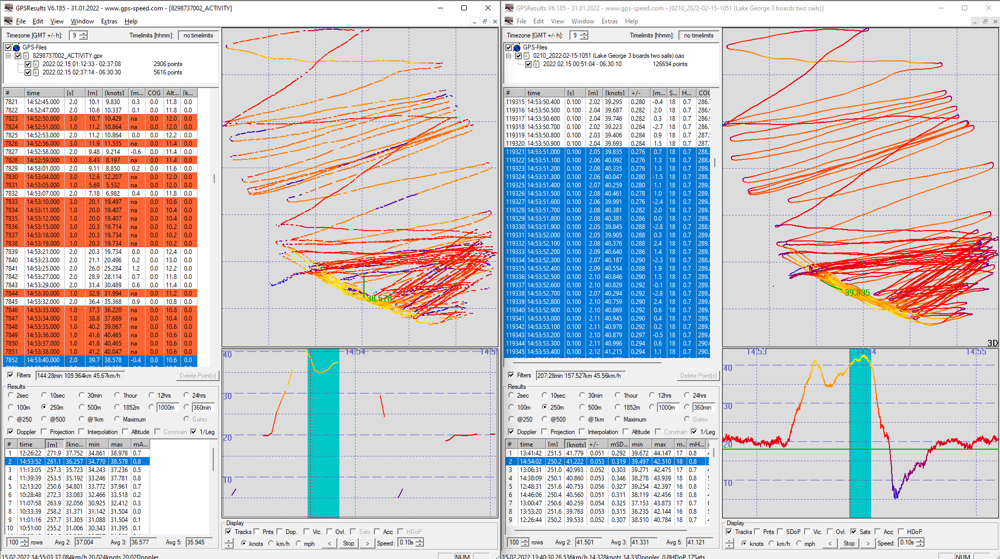

## Dave's Tracks

### Devices

- Motion Mini
- Fenix 6X Pro

### Observations

Data is not being recorded every second. David subsequently confirmed the watch was recording in "smart" mode.

### Track Data

You can find all of the tracks on [GitHub](https://github.com/Logiqx/gps-guides) under sessions/contacts/mord/tracks.

