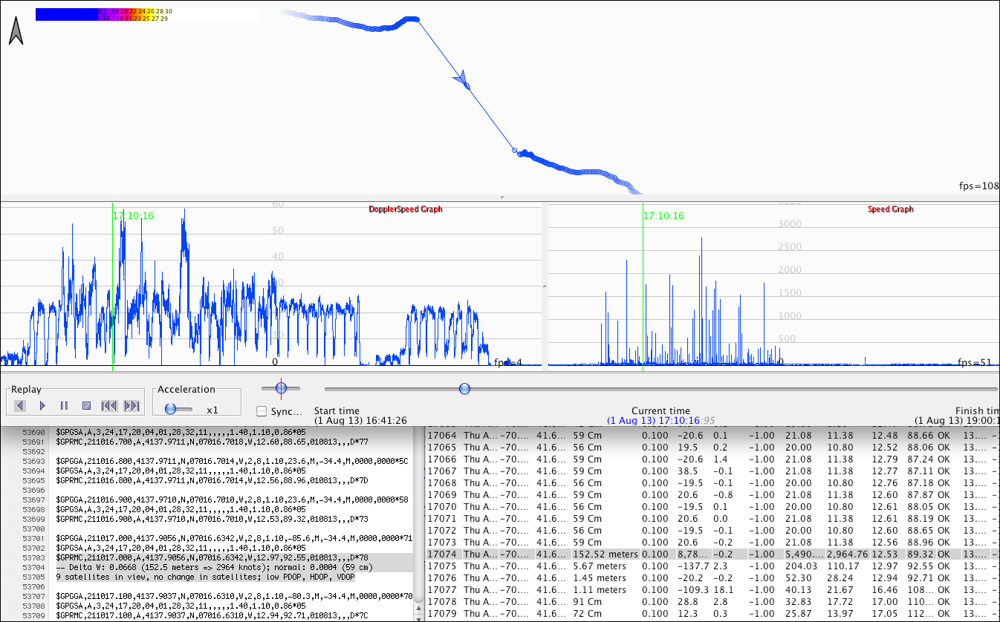

## Peter's Tracks

### 2013

The GPS modules was an f-tech FMP04-TLP, which used an MT3329 and was able to record at 10 Hz.

Huge spikes were present in the positional data and the speed data, suggesting it is not purely Doppler derived.

Results from GpsarPro:

- Positional data speed spikes > 24,000 knots.
- Max. 1 second non-doppler speed of about 480 knots.
- Max. 1 second speed (regular speed, referred to as Doppler) of 51.77 knots.
- Actual max. 1 sec speed (from GT-31) of 24.76 knots.

Note: GPSResults appears to have a limit of 1,000 km/h, so it isn't possible to analyze the spikes in this track properly. 

There was no definitive response about the chip using Doppler to calculate speeds. The message from f-tech reads:

> As I remember that our GPS system do not use doppler to calculate SOG.  I will check with our design dept. to know about this.

### Track Data

You can find all of the tracks on [GitHub](https://github.com/Logiqx/gps-guides) under sessions/contacts/ricp/tracks.

