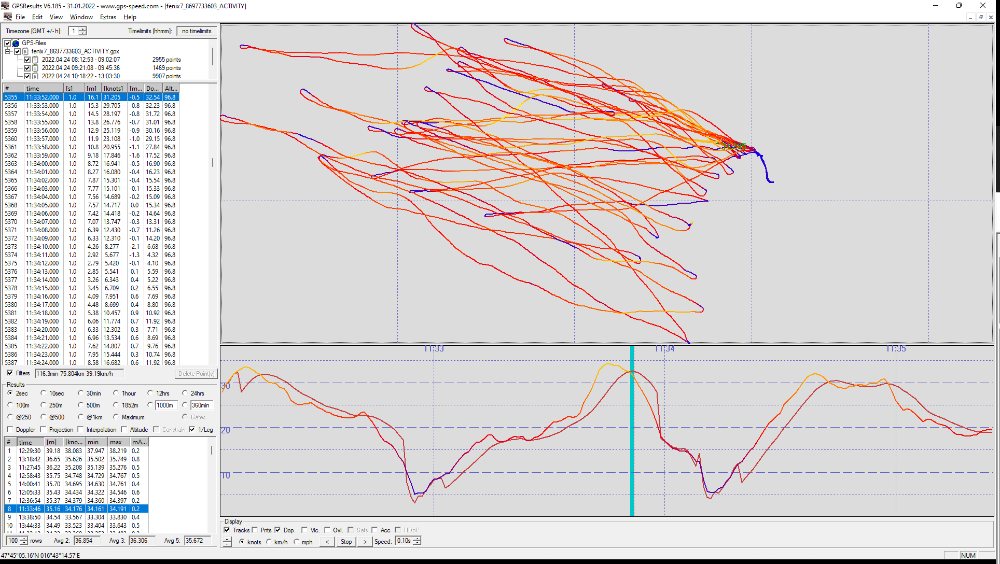

## Manuel's Tracks

### Devices

- GT-31 - firmware V1.2(B1405x)

- Fenix 5 Plus - GPS + GLONASS

- Fenix 7 - Multiband

### Highlights

- Fenix 5 Plus and GT-31 results are very comparable.
  - Fenix is sometimes 0.2 - 0.3 knots higher (sometimes lower) but nothing too crazy.
- Fenix 5 speed data looks like it could well be Doppler-derived.
  - It certainly isn't just smoothed speeds / rolling average from positional data.
- Fenix 7 data is trash!
  - See image below which shows right-shift and weird downward spike. Suspect use of a rolling average, causing the shift.

### Details

The GT-31 and Fenix 5 Plus results are very comparable with the two generally within 0.1-0.2 knots for results across the various speed categories. However, the Fenix 7 is reporting much lower than the other two devices.

The image below shows the Fenix 5 Plus (left) vs Fenix 7 (right). I've displayed the tracks such that the "Doppler speeds" (n.b. we don't know for sure what Garmin is recording) and non-Doppler speeds are overlaid. The speed data from the Fenix 5 looks typical of a working GPS device and the speed graphs closely match the GT-31, especially what I suspect to be the Doppler-derived speeds. n.b. I won't go into why I think the speeds from the Fenix 5 Plus are Doppler-derived right now, since it's a topic in its own right.

The Fenix 7 speed data (right image) looks very similar in nature to my friend's Fenix 7 track. What should be the Doppler-derived data is shifted right by several seconds, it is heavily smoothed and has flattened peaks.

Aside from the heavy smoothing (likely a basic rolling average but without centring, plus some basic filtering when stationary) there are also some weird downward spikes in the speed data. The shifting to the right wasn't present in tracks from an earlier version of the Fenix 7 firmware but the downward spikes were also present in tracks that I have seen from the earlier firmware.

Garmin are definitely doing something peculiar with the speed data received from the GNSS chip. So far as I know it's the same chip as the COROS VERTIX 2 and that watch doesn't have these issues.

I'd be sure to complain to Garmin if I owned a Fenix 7. They should definitely look to fix this issue!

### Track Data

You can find all of the tracks on [GitHub](https://github.com/Logiqx/gps-guides) under sessions/contacts/zugsm/tracks.

