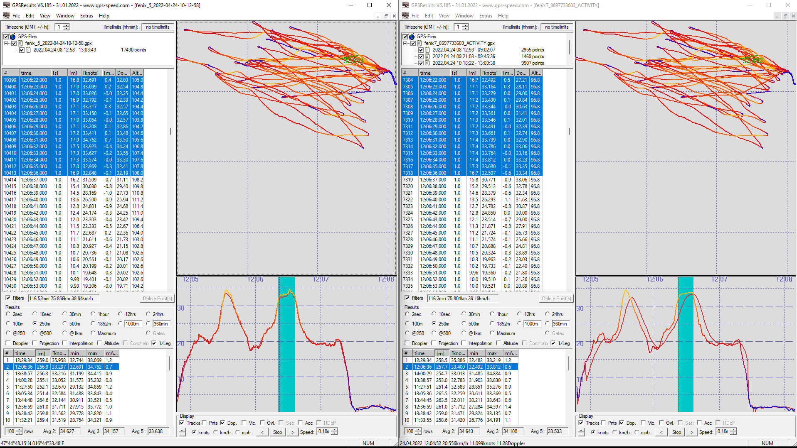

## Manuel's Tracks

### Devices

- GT-31 - firmware V1.2(B1405x)

- Fenix 5 Plus - GPS + GLONASS

- Fenix 7 - Multiband

### Highlights

- Fenix 5 Plus and GT-31 results are very comparable.
  - Fenix is sometimes 0.2 - 0.3 knots higher (sometimes lower) but nothing too crazy.
- Fenix 5 speed data looks like it could well be Doppler-derived.
  - It certainly isn't just smoothed speeds / rolling average from positional data.
- Fenix 7 data is trash!
  - See image below which shows right-shift and weird downward spike. Suspect use of a rolling average, causing the shift.

### Track Data

You can find all of the tracks on [GitHub](https://github.com/Logiqx/gps-guides) under sessions/contacts/zugsm/tracks.

