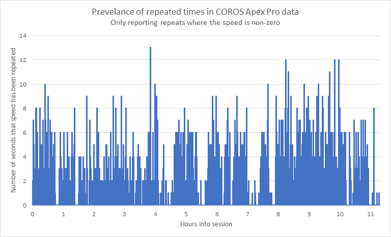
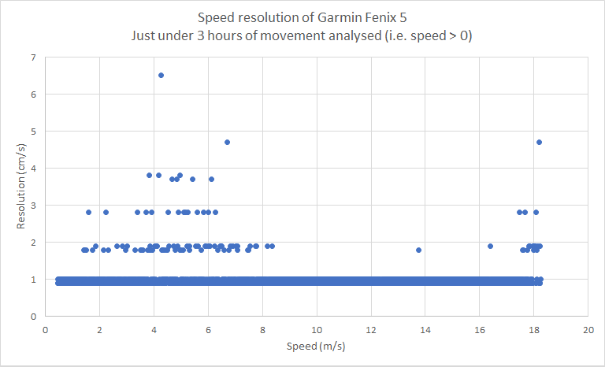
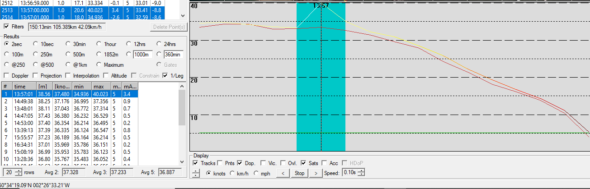

## Mark's Tracks

### COROS APEX Pro

Mark provided 3 tracks from 2021 to confirm the observations relating to my own APEX Pro.

Repeated speeds were abundant in Mark's data, as per my own APEX Pro sessions. The chart below illustrates that repeats for 5 or 6 seconds are not uncommon and can be go on for as long as 13 seconds.

I was also able to confirm the speed resolution of 5cm/s by combining the data from all 3 sessions. Speeds below 8 knots (4 m/s) can sometimes have a higher resolution.

### Garmin Fenix 5

Mark also provided me with a track from the Garmin Fenix 5.

I was able to confirm the resolution of 1cm/s which is the same as Locosys devices; e.g. GT-31, GW-52, GW-60:

In addition to confirming the resolution of Doppler speeds, it also proved to be a good example of why non-Doppler speeds should not be trusted.

The screenshot from GPSResults 6.185 clearly shows a 40 knot spike (yellow) in the speed calculated from positional data.

The true speed (red) was about 33 knots which was consistent with the GW-60 track that was also provided.

